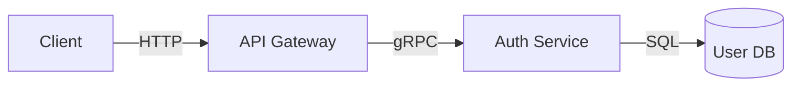

# Data Flow Architect

Design and document comprehensive data flow architectures across systems, services, networks, databases, and protocols. Create clear, maintainable documentation that enables any stakeholder to understand how data moves through your entire system—from sources to storage to consumers.

## When to use me

Use this skill when:
- You need to document data flows for a new system or service
- You're onboarding new team members and need clear architecture documentation
- You're debugging data-related issues and need to trace data paths
- You're planning system changes and need to understand current data flows
- You're creating API documentation and need to show data relationships
- You need to communicate data architecture to non-technical stakeholders
- You're conducting security reviews and need to trace data through the system
- You want to ensure consistency across multiple diagrams and documents

## What I do

- **Systematic data flow analysis**: Map all data paths from entry to exit
- **Multi-level documentation**: Create conceptual, logical, and physical views
- **Protocol-aware design**: Document HTTP, WebSockets, gRPC, message queues, etc.
- **Storage architecture**: Map databases, caches, file systems, and data lakes
- **Network topology**: Document network segments, firewalls, load balancers
- **Service mesh mapping**: Trace requests across microservice boundaries
- **Data transformation tracking**: Document parsing, validation, enrichment, aggregation
- **Error handling flows**: Map how data handles failures and retries
- **Security boundary mapping**: Document authentication, authorization, encryption

## Core Methodology

### 1. The Three Views of Data Flow

**A. Conceptual View (Business/PM focused)**
- What data enters and exits the system
- Business value and purpose of data flows
- Key entities and their relationships
- User-relevant outcomes of data processing

**B. Logical View (Developer/Architect focused)**
- Services and their responsibilities
- Data transformations and processing steps
- API contracts and interfaces
- Protocol specifications
- Data schema definitions

**C. Physical View (Operations/DevOps focused)**
- Infrastructure components
- Network topology and segments
- Deployment architecture
- Scalability considerations
- Performance characteristics

### 2. Data Flow Levels

**Level 0: System Context**
- External entities interacting with the system
- Trust boundaries
- High-level input/outputs

**Level 1: Container Diagram**
- Major containers (services, databases, caches)
- Interactions between containers
- Technology choices per container

**Level 2: Component Diagram**
- Components within each container
- Data transformations within services
- Internal queues and buffers

**Level 3: Sequence/Activity Diagrams**
- Detailed flow for critical paths
- Timing and sequencing
- Error handling and recovery

### 3. Documentation Components

For each data flow, document:

**Source**
- Origin of data (user, system, external API)
- Format and schema
- Frequency and volume
- Authentication requirements

**Transport**
- Protocol used (HTTP, gRPC, WebSocket, AMQP, Kafka, etc.)
- Network path and security zones traversed
- Middleware involved (load balancers, API gateways)
- Serialization format (JSON, Protobuf, Avro, etc.)

**Processing**
- Transformations applied
- Validations and enrichments
- Business logic executed
- State changes triggered

**Storage**
- Where data is persisted
- Schema and indexing
- Retention policies
- Backup and recovery

**Destinations**
- Where data flows next
- Consumer types (service, user, external system)
- Required SLA for delivery

## Data Flow Patterns

### Synchronous Request-Response
```
Client → API Gateway → Auth Service → User DB
                ↓
         Response Path
```
- **Use when**: Immediate response required
- **Characteristics**: Low latency, tight coupling, failure visibility

### Async Messaging (Point-to-Point)
```
Producer → Queue → Consumer
```
- **Use when**: Decoupling needed, fire-and-forget, load leveling
- **Characteristics**: Loose coupling, delivery guarantees, ordering

### Publish-Subscribe
```
Publisher → Topic ← Subscriber 1
                  ← Subscriber 2
                  ← Subscriber 3
```
- **Use when**: Multiple consumers need same data, event-driven architecture
- **Characteristics**: Fan-out, message consumption independence

### Event Streaming
```
Producer → Stream → Processor 1 → Processor 2 → Consumer
                            ↓
                      Materialized View
```
- **Use when**: High-throughput, time-ordered, replay capability needed
- **Characteristics**: Immutable log, event sourcing, CQRS

### Batch Processing
```
Source → ETL Job → Data Warehouse
              ↓
         Validation
              ↓
         Audit Trail
```
- **Use when**: Large volume processing, complex transformations
- **Characteristics**: Scheduled execution, checkpointing, retry handling

### Saga Pattern (Distributed Transactions)
```
Service A → Saga Orchestrator → Service B → Compensating Transaction
                              → Service C → Compensating Transaction
```
- **Use when**: Multi-service transactions without distributed locks
- **Characteristics**: Compensating actions for rollback, eventual consistency

### Circuit Breaker Pattern
```
Client → Circuit Breaker → Service
              ↓
         [OPEN] → Fallback Response
              ↓
         [HALF-OPEN] → Test Request
```
- **Use when**: Preventing cascade failures, protecting failing services
- **Characteristics**: States (closed/open/half-open), failure thresholds, timeout

### CQRS (Command Query Responsibility Segregation)
```
Command Side: Client → Command Handler → Event Publisher → Event Store
Query Side: Client → Query Handler → Read Model ← Materialized Views
```
- **Use when**: Read/write workloads differ significantly
- **Characteristics**: Separate models, eventual consistency, optimized reads

### Multi-Region Active-Active
```
Region A ←→ Replication ←→ Region B
   ↓                        ↓
User Traffic            User Traffic
```
- **Use when**: High availability, disaster recovery, geographic latency
- **Characteristics**: Bidirectional sync, conflict resolution, failover

## Common Data Flow Scenarios

### User Authentication Flow
```
1. User → Browser → Login Form
2. Browser → API Gateway → /auth/login (JSON)
3. API Gateway → Auth Service (validate credentials)
4. Auth Service → User DB (verify hash)
5. Auth Service → Token Service (generate JWT)
6. Token Service → Auth Service (return token)
7. Auth Service → API Gateway (200 OK + token)
8. API Gateway → Browser (set cookie/session)
```

### Order Processing Flow
```
1. User → Web App → Create Order (REST)
2. Web App → Order Service → Validate Order
3. Order Service → Inventory Service → Check Stock (gRPC)
4. Inventory Service → Inventory DB → Query
5. Order Service → Payment Service → Process Payment (async)
6. Payment Service → Payment DB → Record Transaction
7. Order Service → Message Queue → Order Created Event
8. Notification Service ← Order Created Event
9. User ← Email Service ← Send Confirmation
```

### Data Pipeline Flow
```
Source System → CDC → Kafka → Stream Processor → S3 → Analytics
                         ↓
                    Data Lake
                         ↓
                  Transformation
                         ↓
                    Business DB
```

### GDPR Compliance Flow (Right to be Forgotten)
```
1. Deletion Request → Identity Verification
2. Data Locator Service → Find All PII Instances
3. Parallel: Database, Cache, Analytics, Backups
4. Execute Cascade Deletions
5. Anonymize Where Required (audit logs)
6. Notify Third Parties (if data shared)
7. Send Confirmation to User
8. Update Audit Trail
```

### Saga Distributed Transaction Flow
```
1. Order Service → Create Order (pending)
2. Inventory Service → Reserve Items (or compensate)
3. Payment Service → Charge Payment (or compensate)
4. Shipping Service → Schedule Shipment (or compensate)
5. If any step fails → Execute compensating transactions in reverse
6. Order marked as confirmed or rolled back
```

## Data Flow Discovery Protocol

Before documenting, DISCOVER all data flows systematically:

### Phase 1: Static Analysis
- Run dependency analysis on codebase
- Identify all API endpoints and their consumers
- Map database tables to services
- Find message queue topics and subscriptions

### Phase 2: Dynamic Analysis
- Enable distributed tracing (OpenTelemetry)
- Trace real requests through the system
- Identify actual vs. documented flows
- Find "shadow" flows (backups, ETL, analytics)

### Phase 3: Stakeholder Interviews
- Systematic questionnaire for developers
- Architecture review sessions
- "Walking the system" exercise
- Identify tribal knowledge gaps

### Handling Unknown Data Flows
When you discover data flows you can't fully document:
1. **Mark as "TBD"**: Use `[TBD - Investigation Required]`
2. **Add to backlog**: Create tickets to investigate
3. **Use monitoring**: Deploy network flow analysis to auto-discover
4. **Interview stakeholders**: Talk to ops teams, DBAs, security
5. **Accept uncertainty**: Document "receives data from [unknown source]"

⚠️ **Risk**: Undocumented data flows are security and compliance risks. Prioritize investigation.

## Documentation Templates

### Data Flow Document Structure

```markdown
# Data Flow Architecture: [System Name]

## Executive Summary
[Brief description of data architecture and business value]

## System Context
[External entities, trust boundaries, high-level view]

## Data Sources
| Source | Type | Format | Frequency | Volume |

## Data Destinations  
| Destination | Type | Format | Consumer |

## Data Flows

### [Flow Name]
**Purpose**: [What this flow accomplishes]
**Source**: [Origin entity]
**Destination**: [Final destination]

#### Path
1. [Step 1 with component and protocol]
2. [Step 2 with component and protocol]
3. [Step N...]

#### Data Transformation
| Stage | Input | Transformation | Output |

#### Error Handling
| Error Condition | Handling Strategy | Retry Policy |

#### Security
- Authentication: [Method]
- Authorization: [Method]
- Encryption: [In-transit/At-rest]

## Storage Architecture
| Store | Type | Purpose | Schema |

## Network Architecture
| Zone | Components | Security Controls |

## Appendix
- Glossary
- Protocol specifications
- Schema definitions
```

### Data Flow Diagram Notation

```
┌─────────────┐     HTTP      ┌─────────────┐     gRPC     ┌─────────────┐
│   Client    │──────────────→│ API Gateway │────────────→│ Auth Service│
└─────────────┘               └─────────────┘              └─────────────┘
                                    │                            │
                              [mTLS]                      [JWT]
                                    │                            │
                              ┌─────▼─────┐              ┌──────▼──────┐
                              │ Rate Limit │              │ Verify Token │
                              └───────────┘              └──────────────┘
```

## Best Practices

### 1. Show the System from Different Angles
- **Conceptual**: Business value and outcomes
- **Logical**: Services, transformations, contracts
- **Physical**: Infrastructure, networks, deployment

### 2. Make Diagrams the Star
- Use consistent notation across all diagrams
- Label everything clearly
- Show data flow direction with arrows
- Include protocol and format annotations

### 3. Document Data in Motion and at Rest
- **Data in Motion**: Real-time flows, transformations, latency requirements
- **Data at Rest**: Storage systems, schemas, retention, access patterns

### 4. Map Security Boundaries
- Show trust boundaries clearly
- Document authentication and authorization at each boundary
- Indicate encryption requirements (TLS, at-rest)

### 5. Include Error and Failure Flows
- What happens when a service is unavailable?
- How does the system handle partial failures?
- What are the retry and backoff strategies?

### 6. Use Consistent Naming
- Same component name across all diagrams
- Consistent arrow meanings (synchronous vs async)
- Standard symbols for similar components

### 7. Include Compliance and Privacy Flows
- Document PII data flows separately
- Map GDPR/CCPA/HIPAA requirements to data flows
- Include data retention and deletion flows
- Document cross-border data transfer mechanisms

## ⚠️ Security Warning: What NOT to Document

**NEVER document in data flow diagrams:**
- ❌ API keys, tokens, or credentials
- ❌ Internal IP addresses or network details (use generic labels like "Internal Network")
- ❌ Specific software versions (enables vulnerability fingerprinting)
- ❌ Detailed error messages that reveal system internals
- ❌ Secrets, passwords, or cryptographic keys

**Use placeholders instead:**
- ✓ `Authorization: [JWT Token]` - not actual token value
- ✓ `Network: [Internal Zone]` - not 10.0.0.0/24
- ✓ `Service: [Auth Service]` - not "Auth Service v2.1.3"

**Always review diagrams before external sharing.** Have security team approve data flow documentation that will be shared outside the organization.

## Common Mistakes to Avoid

### ❌ Technical Jargon Without Context
Don't write: "The Auth Service validates JWTs via mutual TLS to the User DB."
Do write: "When a user logs in, their password is verified against the User Database. If correct, they're issued a token for subsequent requests."

### ❌ Inconsistent Component Naming
Don't use: "Auth Service" in one diagram and "Authentication Service" in another.
Do use: "Auth Service" consistently everywhere.

### ❌ Missing Error Flows
Don't: Only document happy paths.
Do: Document how data handles failures, retries, and edge cases.

### ❌ Static Images Only
Don't: Create diagrams that can't be updated easily.
Do: Use "diagrams as code" (Mermaid, PlantUML) that can be version controlled.

### ❌ Ignoring the "Why"
Don't: Just show what happens, not why it happens that way.
Do: Document rationale for key architectural decisions.

## Tools and Integration

### Diagrams as Code


### Data Flow Script Generation
```bash
# Generate data flow documentation
./scripts/generate-data-flow.sh \
  --system "order-service" \
  --output-dir "./docs/data-flows" \
  --format "mermaid,markdown"

# Validate data flow consistency
./scripts/validate-data-flow.sh \
  --spec-dir "./docs/data-flows" \
  --level "container"
```

## Integration with Other Skills

- **`sherlock-debugging`**: Trace data flows when debugging issues
- **`exhaustive-specification`**: Include data flow in comprehensive specs
- **`spec-gap-analysis`**: Verify implementation matches data flow design
- **`adversarial-thinking`**: Attack data flow design for vulnerabilities
- **`trust-but-verify`**: Validate data flows match actual system behavior

## Notes

- **Multi-level thinking**: Always consider conceptual, logical, and physical views
- **Stakeholder clarity**: Adapt presentation based on audience (business vs technical)
- **Living documentation**: Keep data flow docs updated with system changes
- **Traceability**: Link data flows to requirements and specifications
- **Completeness**: Document both happy paths and error scenarios

Remember: Good data flow documentation enables anyone—from new developers to security auditors—to understand exactly how data moves through your system and where it goes.