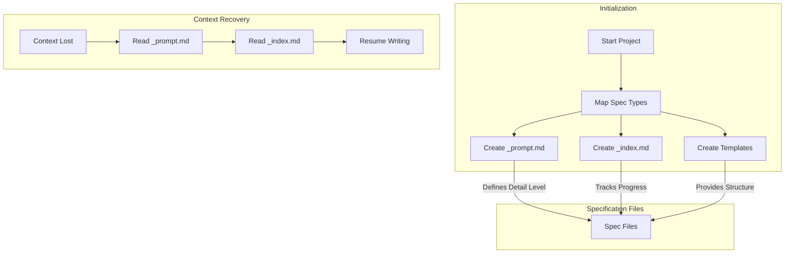
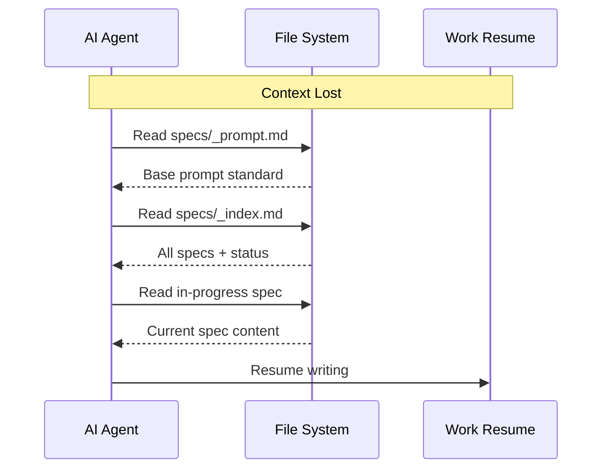

# Exhaustive Specification Writing

Write exhaustive specifications for autonomous AI systems that leave nothing to chance. Create specs so detailed that a blind person could visualize the entire system. Uses `_prompt.md` for consistency and `_index.md` for tracking - context can be lost and restored without losing spec direction.

## When to use me

Use this skill when:
- You need specifications for autonomous AI agents to build complete systems without human intervention
- Current AI-generated specs are insufficiently detailed and leave critical aspects ambiguous
- You're building complex systems where every detail matters
- You want specs that survive context loss through `_prompt.md` and `_index.md`
- You need to map out ALL spec types before writing begins

## Core Architecture



## Three Core Files

### 1. `_prompt.md` - The Base Prompt

The canonical prompt that defines the level of detail for ALL specs. Every spec generated uses this as the foundation.

**Location**: `specs/_prompt.md`

**Purpose**:
- Ensures consistent detail level across all specs
- Survives context loss - new sessions read this to maintain quality
- Defines the "exhaustive standard" for the project

```markdown
# Exhaustive Specification Prompt

## Detail Level Standard

**BLIND-PERSON VISUALIZATION**: Write specs so detailed that someone who cannot see can fully visualize the system. Every UI element, animation, color, interaction must be described in prose.

**NO ASSUMPTIONS**: Every decision must be explicit. Never write "as discussed" or "standard practice". Define everything.

**EXHAUSTIVE COVERAGE**: 
- Happy path + ALL error paths
- All edge cases enumerated
- All timing, sizing, spacing specified
- All states and transitions documented
- All data transformations explained

## Writing Standards

### For UI/UX Specs
- Exact pixel dimensions, colors (hex codes), fonts
- Animation timing (ms), easing functions
- Responsive breakpoints
- Accessibility requirements (WCAG level)
- Error states, loading states, empty states

### For API Specs  
- Request/response schemas with examples
- All error codes with causes and resolutions
- Rate limits, timeouts, retry behavior
- Authentication/authorization for each endpoint
- Idempotency requirements

### For Database Specs
- Complete schema with constraints
- Index strategy and rationale
- Query patterns with example queries
- Migration strategies
- Backup/recovery procedures

### For Logic Specs
- Step-by-step algorithms
- Decision trees for all branches
- Input validation at each step
- State machines with all transitions
- Error handling at each step

## Structure Template

Every spec follows this structure:

1. **Overview** - What this component does
2. **Dependencies** - What it requires
3. **Interface** - How it interacts with other components
4. **Behavior** - Detailed logic (happy path + error paths)
5. **Data** - Data structures, schemas
6. **States** - All possible states and transitions
7. **Errors** - All error conditions and handling
8. **Testing** - Test cases to validate
9. **Security** - Security considerations
10. **Performance** - Performance requirements

## Quality Gates

Before marking any spec complete:
- [ ] Can a blind person visualize this from the description?
- [ ] Is every assumption explicitly stated?
- [ ] Are all error paths documented?
- [ ] Are all edge cases enumerated?
- [ ] Is there an example for every data structure?
- [ ] Are all timings/sizings specified with units?
```

### 2. `_index.md` - The Spec Index

Tracks all specs in the system with status, dependencies, and completeness.

**Location**: `specs/_index.md`

**Purpose**:
- Single source of truth for what specs exist
- Tracks completion status
- Maps dependencies between specs
- Enables context recovery - know exactly what to continue

```markdown
# Specification Index

**Project**: [Project Name]
**Last Updated**: YYYY-MM-DD
**Total Specs**: 12
**Completed**: 8
**In Progress**: 2
**Pending**: 2

## Spec Registry

| ID | Spec File | Category | Status | Dependencies | Lines | Last Modified |
|----|-----------|----------|--------|--------------|-------|---------------|
| S01 | 01-system-overview.md | Core | ✅ Complete | None | 1,234 | 2026-03-24 |
| S02 | 02-ui-main.md | UI | ✅ Complete | S01 | 3,456 | 2026-03-24 |
| S03 | 03-ui-modals.md | UI | 🔄 In Progress | S01, S02 | 892 | 2026-03-24 |
| S04 | 04-api-auth.md | API | ✅ Complete | S01 | 2,345 | 2026-03-23 |
| S05 | 05-api-users.md | API | ✅ Complete | S01, S04 | 1,876 | 2026-03-23 |
| S06 | 06-api-orders.md | API | 🔄 In Progress | S01, S05 | 456 | 2026-03-24 |
| S07 | 07-database-schema.md | Database | ✅ Complete | S01 | 2,789 | 2026-03-22 |
| S08 | 08-database-migrations.md | Database | ✅ Complete | S07 | 987 | 2026-03-22 |
| S09 | 09-security.md | Security | ✅ Complete | S01, S04, S07 | 1,567 | 2026-03-21 |
| S10 | 10-deployment.md | Operations | ⏳ Pending | All | 0 | - |
| S11 | 11-performance.md | Operations | ⏳ Pending | S02, S05, S07 | 0 | - |
| S12 | 12-testing.md | QA | ✅ Complete | All | 4,567 | 2026-03-24 |

## Dependency Graph

```
S01 (Overview)
├── S02 (UI Main) ──┬── S03 (UI Modals)
│                   │
├── S04 (API Auth) ─┼── S05 (API Users) ──┬── S06 (API Orders)
│                   │                      │
├── S07 (DB Schema) ─┼── S08 (DB Migrations)
│                   │
├── S09 (Security) ─┘
│
└── S10 (Deployment) [needs all]
    └── S11 (Performance) [needs S02, S05, S07]
    
S12 (Testing) [needs all]
```

## Categories

### Core (1 spec)
- [x] S01: System Overview

### UI (2 specs)
- [x] S02: Main UI
- [ ] S03: Modal Components (in progress)

### API (3 specs)
- [x] S04: Authentication API
- [x] S05: Users API
- [ ] S06: Orders API (in progress)

### Database (2 specs)
- [x] S07: Database Schema
- [x] S08: Migrations

### Security (1 spec)
- [x] S09: Security Specification

### Operations (2 specs)
- [ ] S10: Deployment (pending)
- [ ] S11: Performance (pending)

### QA (1 spec)
- [x] S12: Testing Strategy

## Next Actions

1. Complete S03: UI Modals (blocking: S03)
2. Complete S06: Orders API (blocking: S06)
3. Start S10: Deployment (blocked by: S03, S06)
4. Start S11: Performance (blocked by: S03, S06)
5. Update S12: Testing after all specs complete

## Notes

- S03 blocked on modal animation specs
- S06 needs error handling for order states
- S12 needs to be updated after S10, S11 complete
```

### 3. Spec Type Templates

Pre-defined templates for each spec type ensure nothing is missed.

## Spec Type Mapping

### Tier 1: Foundation Specs (Start Here)

| ID | Spec Type | Purpose | Template File |
|----|-----------|---------|---------------|
| S01 | System Overview | Project purpose, architecture, success criteria | `templates/01-system-overview.md` |
| S02 | Domain Model | Entities, value objects, aggregates | `templates/02-domain-model.md` |
| S03 | Glossary | Terms, definitions, domain language | `templates/03-glossary.md` |

### Tier 2: UI/UX Specs

| ID | Spec Type | Purpose | Template File |
|----|-----------|---------|---------------|
| U01 | UI Layout | Page layouts, components, responsive | `templates/u01-ui-layout.md` |
| U02 | UI Flows | User journeys, state transitions | `templates/u02-ui-flows.md` |
| U03 | UI Components | Buttons, forms, modals, cards | `templates/u03-ui-components.md` |
| U04 | UI Animations | Transitions, micro-interactions | `templates/u04-ui-animations.md` |
| U05 | UI Accessibility | ARIA, keyboard nav, screen readers | `templates/u05-ui-accessibility.md` |
| U06 | UI Error States | Validation, error messages, recovery | `templates/u06-ui-error-states.md` |

### Tier 3: API Specs

| ID | Spec Type | Purpose | Template File |
|----|-----------|---------|---------------|
| A01 | API Overview | Endpoints summary, versioning, authentication | `templates/a01-api-overview.md` |
| A02 | API Authentication | Auth flows, token management | `templates/a02-api-auth.md` |
| A03 | API Resources | CRUD endpoints for each resource | `templates/a03-api-resources.md` |
| A04 | API Errors | Error codes, messages, recovery | `templates/a04-api-errors.md` |
| A05 | API Rate Limiting | Throttling, quotas, backoff | `templates/a05-api-rate-limiting.md` |
| A06 | API Webhooks | Events, payloads, retry logic | `templates/a06-api-webhooks.md` |

### Tier 4: Data Specs

| ID | Spec Type | Purpose | Template File |
|----|-----------|---------|---------------|
| D01 | Database Schema | Tables, columns, constraints, indexes | `templates/d01-database-schema.md` |
| D02 | Database Queries | Query patterns, optimization | `templates/d02-database-queries.md` |
| D03 | Database Migrations | Version history, upgrade paths | `templates/d03-database-migrations.md` |
| D04 | Data Validation | Input validation, sanitization | `templates/d04-data-validation.md` |
| D05 | Data Retention | Archival, deletion, compliance | `templates/d05-data-retention.md` |

### Tier 5: Business Logic Specs

| ID | Spec Type | Purpose | Template File |
|----|-----------|---------|---------------|
| B01 | Business Rules | Invariants, constraints, calculations | `templates/b01-business-rules.md` |
| B02 | State Machines | Entity states, transitions, guards | `templates/b02-state-machines.md` |
| B03 | Workflows | Multi-step processes, orchestration | `templates/b03-workflows.md` |
| B04 | Calculations | Formulas, algorithms, rounding | `templates/b04-calculations.md` |
| B05 | Notifications | Email, push, in-app alerts | `templates/b05-notifications.md` |

### Tier 6: Cross-Cutting Specs

| ID | Spec Type | Purpose | Template File |
|----|-----------|---------|---------------|
| X01 | Security | AuthZ, encryption, vulnerabilities | `templates/x01-security.md` |
| X02 | Logging | Events, levels, formats, retention | `templates/x02-logging.md` |
| X03 | Monitoring | Metrics, dashboards, alerts | `templates/x03-monitoring.md` |
| X04 | Error Handling | Global error handling, recovery | `templates/x04-error-handling.md` |
| X05 | Configuration | Env vars, feature flags, secrets | `templates/x05-configuration.md` |

### Tier 7: Operations Specs

| ID | Spec Type | Purpose | Template File |
|----|-----------|---------|---------------|
| O01 | Deployment | CI/CD, environments, rollbacks | `templates/o01-deployment.md` |
| O02 | Infrastructure | Servers, containers, networking | `templates/o02-infrastructure.md` |
| O03 | Performance | Benchmarks, load testing, SLAs | `templates/o03-performance.md` |
| O04 | Backup & Recovery | Backups, disaster recovery | `templates/o04-backup-recovery.md` |
| O05 | Runbooks | Incident response, maintenance | `templates/o05-runbooks.md` |

### Tier 8: Quality Specs

| ID | Spec Type | Purpose | Template File |
|----|-----------|---------|---------------|
| Q01 | Test Strategy | Coverage, types, automation | `templates/q01-test-strategy.md` |
| Q02 | Test Cases | Specific test scenarios | `templates/q02-test-cases.md` |
| Q03 | Acceptance Criteria | Definition of done | `templates/q03-acceptance-criteria.md` |
| Q04 | Quality Gates | Review checkpoints | `templates/q04-quality-gates.md` |

## Workflow

### Phase 1: Initialize

```bash
# Create directory structure and core files
bash scripts/init-specs-structure.sh --project "My Project"

# Creates:
# - specs/_prompt.md (base prompt)
# - specs/_index.md (spec index)
# - specs/templates/ (all templates)
# - specs/01-system-overview.md (start with this)
```

### Phase 2: Map Specs

```bash
# Analyze project and determine which specs are needed
bash scripts/map-required-specs.sh --analyze

# Output: List of required specs based on project type
# - Required: S01, A01, D01, Q01
# - Recommended: U01, X01, O01
# - Optional: U04, A06, O05
```

### Phase 3: Generate Specs

```bash
# Generate spec from template
bash scripts/generate-spec.sh --spec-id S01 --from-template

# Generate all pending specs
bash scripts/generate-spec.sh --all-pending
```

### Phase 4: Validate

```bash
# Validate spec completeness
bash scripts/validate-spec.sh --spec-id S01

# Validate all specs
bash scripts/validate-spec.sh --all

# Update index
bash scripts/update-index.sh
```

## Context Recovery

When context is lost, restore by:



1. Read `specs/_prompt.md` → Know the detail standard
2. Read `specs/_index.md` → Know what exists and what's pending
3. Read the in-progress spec → Continue where left off
4. Resume writing with full context

## Scripts

| Script | Purpose |
|--------|---------|
| `init-specs-structure.sh` | Create directory and core files |
| `map-required-specs.sh` | Analyze what specs are needed |
| `generate-spec.sh` | Generate spec from template |
| `validate-spec.sh` | Validate spec completeness |
| `update-index.sh` | Update the spec index |
| `run-adversarial-refinement.sh` | Apply adversarial patterns |

## Integration with Other Skills

- **@skills/adversarial-thinking**: Refinement patterns
- **@skills/notebooklm-federated-specs**: Storage and querying
- **@skills/data-flow-architect**: Data flow documentation
- **@skills/api-documentation**: API specs

## Notes

- **_prompt.md is sacred**: Defines quality standard
- **_index.md is truth**: Single source of spec status
- **Templates ensure completeness**: Never miss a spec type
- **Context recovery is built-in**: Read two files, resume work
- **Map before writing**: Know all specs needed before starting