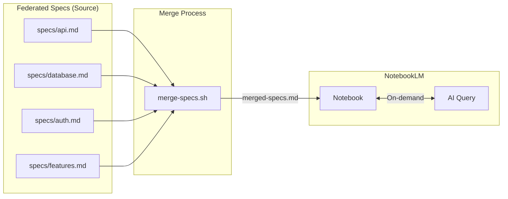
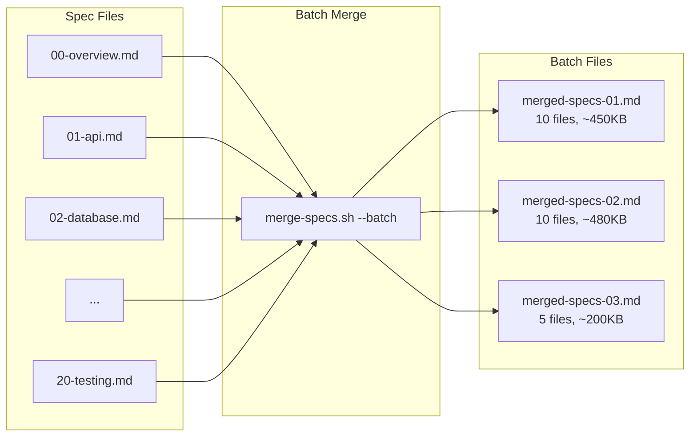
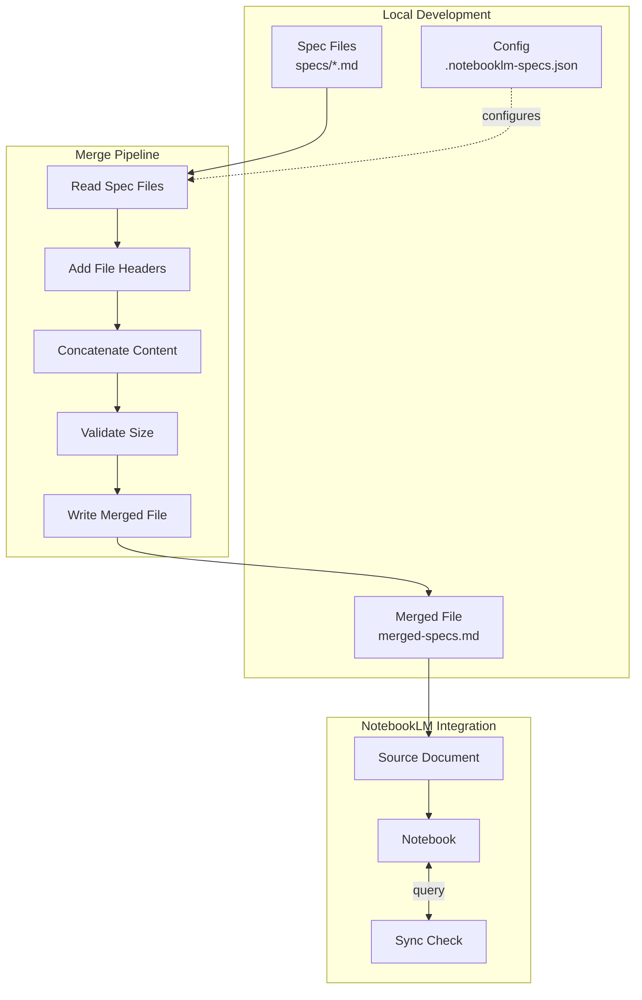
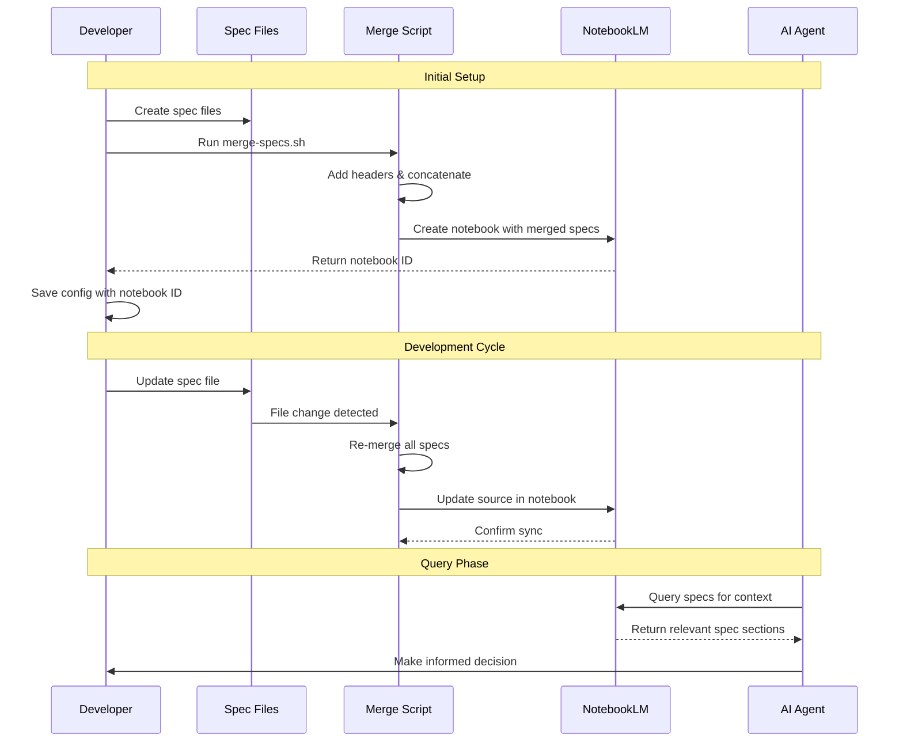
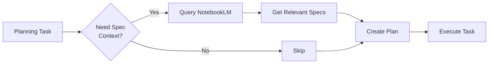
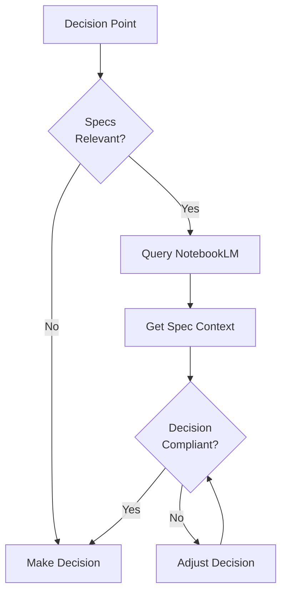

# NotebookLM Federated Specs

Manage federated specification files that merge into NotebookLM notebooks. Keep specs out of your token context while making them queryable for planning, decisions, and development. Specs are concatenated with source filenames for traceability.

## When to use me

Use this skill when:
- You have multiple spec files that exceed context limits
- You want specs available for AI queries without token cost
- You're planning features and need spec context on-demand
- You're making architectural decisions requiring spec references
- You want to keep specs in sync with NotebookLM automatically
- You need to protect token budget while maintaining spec access
- You're working with AI agents that need spec context occasionally

## Core Concept



**Key Benefit**: Specs live in NotebookLM, not in your context window. Query them only when needed.

## Batch Mode (Recommended)

NotebookLM works better with fewer, larger documents. Batch mode splits specs into optimized batches:



**Why Batch Mode?**
- Better NotebookLM performance with fewer sources
- Cross-spec queries remain coherent
- Generated files are git-ignored
- Each batch under 500KB for optimal processing

**Batch Configuration:**
```json
{
  "batch_size": 10,
  "max_batch_size": "500KB"
}
```

## Architecture Overview



## File Structure

```
project/
├── specs/
│   ├── api.md           # API specifications
│   ├── database.md      # Database schemas and relationships
│   ├── auth.md          # Authentication/authorization specs
│   ├── features.md      # Feature specifications
│   ├── constraints.md   # Technical constraints and limits
│   └── decisions.md     # Architecture decision records
├── .notebooklm-specs.json    # Configuration
├── merged-specs.md           # Generated merged file
└── .notebooklm-cache.json    # Sync state cache
```

## Configuration File

Create `.notebooklm-specs.json` in your project root:

```json
{
  "notebook": {
    "id": "uuid-of-notebook",
    "title": "Project Specs",
    "source_id": "uuid-of-merged-source"
  },
  "specs_dir": "./specs",
  "output_file": "./merged-specs.md",
  "include_patterns": ["*.md"],
  "exclude_patterns": ["README.md", "CHANGELOG.md"],
  "max_size_mb": 50,
  "header_format": "## Source: {filename}\n\n*Path: {filepath}*\n\n---\n\n",
  "auto_sync": true,
  "sync_on_change": true
}
```

## Merged Output Format

The merge script produces a file with clear source attribution:

```markdown
# Merged Specifications

Generated: 2026-03-24T10:30:00Z
Files: 4
Total Size: ~45KB

---

## Source: api.md

*Path: specs/api.md*

### API Endpoints

[Content of api.md...]

---

## Source: database.md

*Path: specs/database.md*

### Database Schema

[Content of database.md...]

---

## Source: auth.md

*Path: specs/auth.md*

### Authentication Flow

[Content of auth.md...]

---

## Source: features.md

*Path: specs/features.md*

### Feature Specifications

[Content of features.md...]

---

*Merged by notebooklm-federated-specs skill*
```

## Workflow



## Commands

### Initialize Federated Specs

```bash
# Create spec directory and config
bash scripts/init-specs.sh --project-name "My Project"

# Creates:
# - specs/ directory
# - .notebooklm-specs.json config
# - Initial merged-specs.md
```

### Merge Specs

```bash
# Merge all spec files (single file)
bash scripts/merge-specs.sh

# Merge into batch files (RECOMMENDED for NotebookLM)
bash scripts/merge-specs.sh --batch

# Batch with custom settings
bash scripts/merge-specs.sh --batch --batch-size 10 --max-batch-size 500KB

# Analyze file sizes before merging
bash scripts/merge-specs.sh --analyze

# Dry run (show what would be merged)
bash scripts/merge-specs.sh --dry-run
```

### Sync with NotebookLM

```bash
# Create new notebook from merged specs (single file)
bash scripts/sync-notebook.sh --create --title "Project Specs"

# Create notebook from batch files (RECOMMENDED)
bash scripts/sync-notebook.sh --create --batch --title "Project Specs"

# Update existing notebook
bash scripts/sync-notebook.sh --update

# Check sync status
bash scripts/sync-notebook.sh --status

# Force full resync
bash scripts/sync-notebook.sh --force
```

### Query Specs via AI

```bash
# Query the notebook
bash scripts/query-specs.sh "What are the API rate limits?"

# Query specific spec file
bash scripts/query-specs.sh --source auth.md "How does OAuth flow work?"
```

## Integration with AI Agents

### During Planning



**Usage Pattern**:
1. AI agent receives planning task
2. Agent queries NotebookLM for relevant specs
3. Agent uses specs to inform planning
4. Specs don't consume persistent context tokens

### During Decision Making



## Scripts

### merge-specs.sh

Merges all spec files into a single document with source attribution:

```bash
#!/bin/bash
# Usage examples:

# Basic merge
bash scripts/merge-specs.sh

# With options
bash scripts/merge-specs.sh \
  --config .notebooklm-specs.json \
  --output ./merged-specs.md \
  --max-size 50MB \
  --validate
```

### sync-notebook.sh

Syncs merged specs with NotebookLM:

```bash
#!/bin/bash
# Usage examples:

# Create new notebook
bash scripts/sync-notebook.sh --create --title "My Project Specs"

# Update existing (from config)
bash scripts/sync-notebook.sh --update

# Check if sync needed
bash scripts/sync-notebook.sh --status

# Verbose output
bash scripts/sync-notebook.sh --update --verbose
```

### query-specs.sh

Queries the NotebookLM notebook for spec information:

```bash
#!/bin/bash
# Usage examples:

# Natural language query
bash scripts/query-specs.sh "What are the database indexes?"

# Query with context
bash scripts/query-specs.sh \
  --context "Adding new user field" \
  "What auth changes are needed?"
```

## MCP Tool Integration

This skill integrates with NotebookLM MCP tools:

| Task | MCP Tool |
|------|----------|
| Create notebook | `notebooklm_notebook_create` |
| Add merged specs | `notebooklm_source_add` |
| Update specs | `notebooklm_source_sync_drive` or re-add |
| Query specs | `notebooklm_notebook_query` |
| Get notebook info | `notebooklm_notebook_get` |

## Best Practices

### Spec File Organization

```
specs/
├── 01-overview.md      # Project overview (numbered for order)
├── 02-api.md           # API specifications
├── 03-database.md      # Database schemas
├── 04-auth.md          # Authentication specs
├── 05-constraints.md   # Technical constraints
├── 06-decisions.md     # ADRs
└── 99-glossary.md      # Terms and definitions
```

### Spec File Template

```markdown
# [Spec Name]

> Last Updated: YYYY-MM-DD
> Owner: Team/Person
> Status: Draft | Review | Approved

## Overview

Brief description of what this spec covers.

## Details

[Specification content...]

## Constraints

- Constraint 1
- Constraint 2

## Related Specs

- Link to related spec files

## Change History

| Date | Change | Author |
|------|--------|--------|
| YYYY-MM-DD | Initial | Name |
```

### Size Management

NotebookLM has source limits. Manage with:

1. **Split large specs**: Break 100KB+ files into focused specs
2. **Use include/exclude patterns**: Control what gets merged
3. **Monitor merged size**: Check `--status` before syncing
4. **Archive old specs**: Move deprecated specs to `specs/archive/`

## Output Format

### Merge Output

```
MERGE COMPLETE
==============
Input Files: 6
Output File: merged-specs.md
Total Size: 45.2 KB
Est. Tokens: ~11,300

Files Merged:
  ✓ specs/01-overview.md (2.1 KB)
  ✓ specs/02-api.md (12.4 KB)
  ✓ specs/03-database.md (8.7 KB)
  ✓ specs/04-auth.md (15.2 KB)
  ✓ specs/05-constraints.md (4.3 KB)
  ✓ specs/06-decisions.md (2.5 KB)

Ready to sync with NotebookLM.
```

### Sync Output

```
SYNC STATUS
===========
Notebook: Project Specs (abc-123-def)
Last Sync: 2026-03-24T10:30:00Z
Local Hash: sha256:abc123...
Remote Hash: sha256:abc123...
Status: IN SYNC

Sources: 1 merged document
Size: 45.2 KB
```

## Troubleshooting

### Merged File Too Large

```bash
# Check size breakdown
bash scripts/merge-specs.sh --analyze

# Output shows per-file sizes to help identify what to split
```

### Sync Fails

```bash
# Check authentication
bash scripts/sync-notebook.sh --check-auth

# Force re-auth
nlm login
```

### Query Returns Irrelevant Results

- Ensure specs are well-structured with clear headings
- Add more context to queries
- Use `--source` flag to limit scope

## Integration with Other Skills

- **@skills/exhaustive-specification**: Generate comprehensive specs
- **@skills/data-flow-architect**: Create data flow specs
- **@skills/api-documentation**: Generate API specs
- **@skills/baby-steps**: Break down spec updates into small changes

## Notes

- **Specs stay out of context**: Only load when querying
- **Filenames are preserved**: Easy to trace merged content to source
- **Sync is incremental**: Only update when specs change
- **Query on-demand**: Don't pollute context with unused specs
- **Version control specs**: Source files should be in git
- **Merged file is generated**: Don't edit merged-specs.md directly
