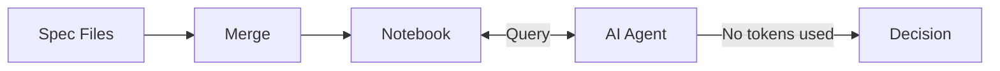
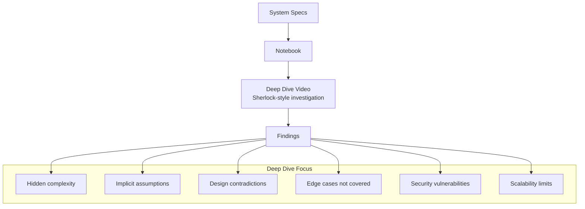
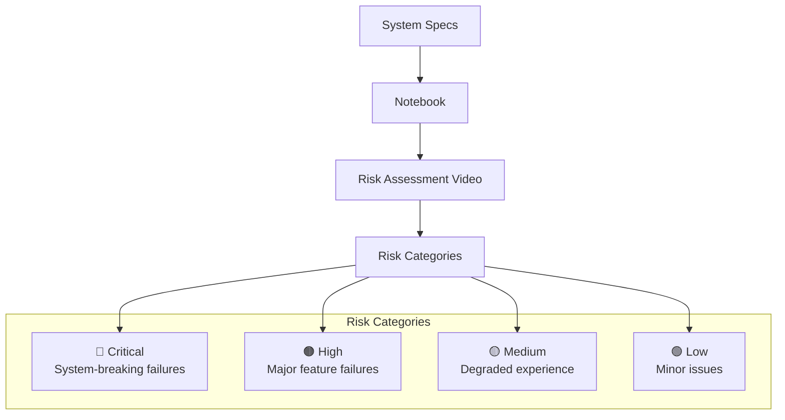
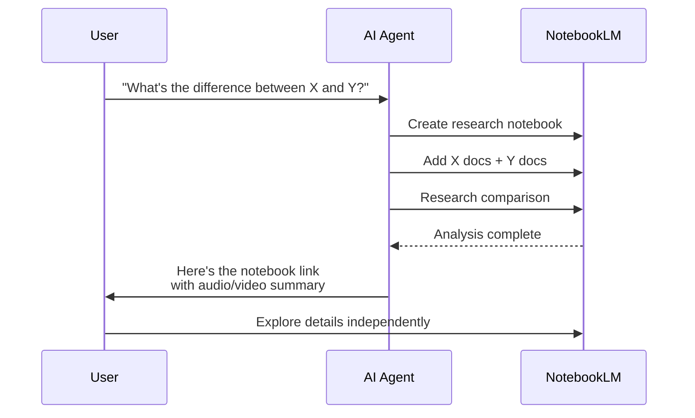
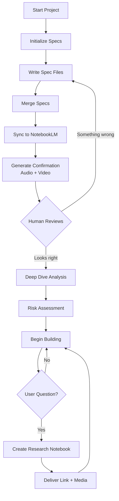
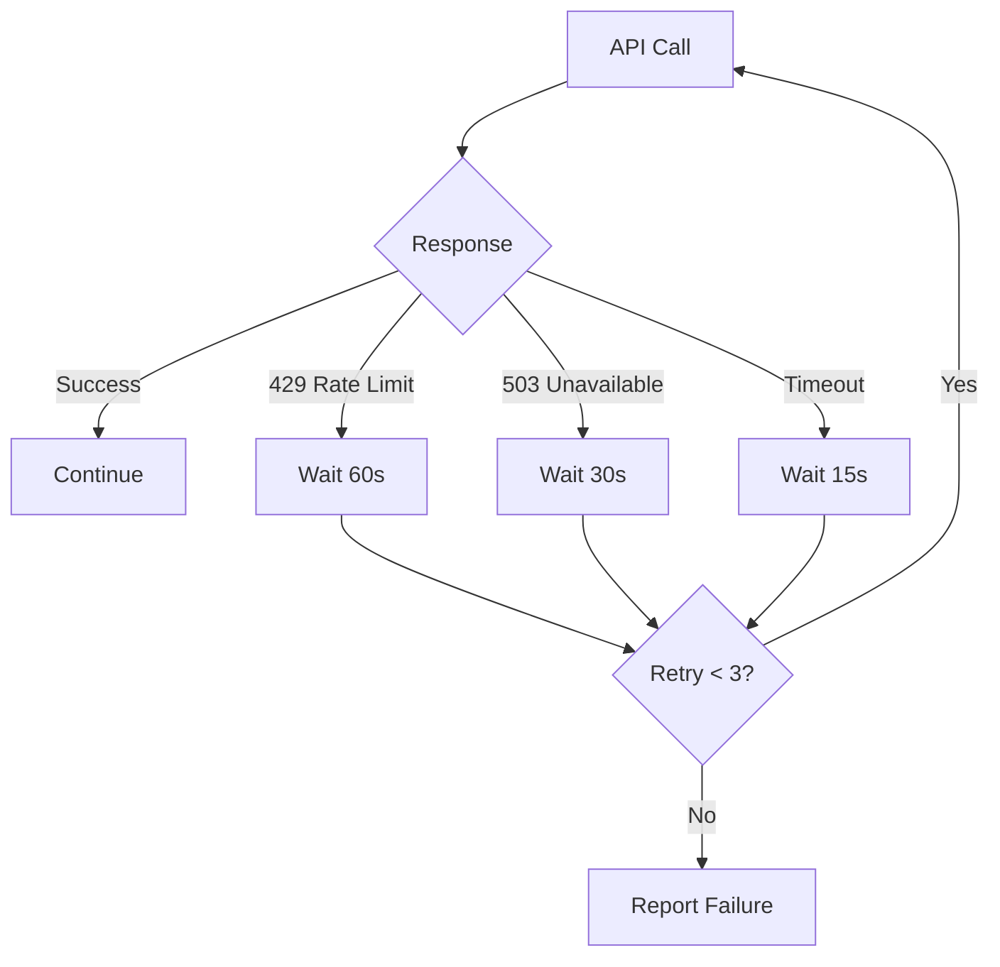

# NotebookLM Federated Specs

Manage federated specification files that merge into NotebookLM notebooks. Go beyond just storing specs - generate **audio/video learning materials** for human understanding, perform **deep dive analysis** of design problems, assess **risks and failure modes**, and create **on-demand research notebooks** for any question.

## Core Capabilities

```mermaid
flowchart TB
    subgraph "Input"
        SPECS[Spec Files<br/>specs/*.md]
        QUESTION[User Question<br/>"What's the difference between X and Y?"]
    end
    
    subgraph "NotebookLM Processing"
        NB[Notebook]
        
        subgraph "For AI Agents"
            Q1[Query Specs<br/>Token-free context]
        end
        
        subgraph "For Humans"
            AV1[Audio Overview<br/>Confirmation & Understanding]
            AV2[Video Deep Dive<br/>Design Analysis]
            AV3[Video Risk Assessment<br/>Failure Modes]
            RESEARCH[Research Notebook<br/>On-demand investigation]
        end
    end
    
    SPECS --> NB
    QUESTION --> RESEARCH
    NB --> Q1
    NB --> AV1
    NB --> AV2
    NB --> AV3
    NB --> RESEARCH
```

## When to use me

Use this skill when:
- **Specs exceed context limits** - Store in NotebookLM, query on-demand
- **You need confirmation** - Generate audio/video to verify you're building what's expected
- **Deep understanding needed** - Sherlock-style deep dive into design problems
- **Risk assessment required** - Understand failure modes and critical risks
- **User has questions** - Create research notebooks for "what's the difference between X and Y"
- **Learning materials needed** - Audio/video for stakeholders to understand the system
- **Planning features** - Get spec context without token cost

## Four Modes of Operation

### Mode 1: Spec Repository (For AI Agents)



Store specs in NotebookLM, query when needed. Specs don't consume persistent context.

### Mode 2: Human Confirmation (Audio + Video)

```mermaid
flowchart TD
    SPECS[System Specs] --> NB[Notebook]
    NB --> AUDIO[Audio Overview<br/>"Here's what we're building..."]
    NB --> VIDEO[Video Overview<br/>Visual walkthrough]
    
    AUDIO --> HUMAN[Human Reviewer]
    VIDEO --> HUMAN
    
    HUMAN -->|"Yes, that's right"| APPROVE[Approve Build]
    HUMAN -->|"No, that's wrong"| CORRECT[Correct Specs]
```

**Purpose**: Ensure you're building what you expect. Listen/watch to confirm understanding.

**Audio Overview Prompts**:
- "Explain the core architecture and what problem it solves"
- "Walk through the main user flows and features"
- "What are the key design decisions and why were they made?"

**Video Overview Options**:
- `explainer`: Detailed system explanation
- `brief`: Quick 2-3 minute summary
- `cinematic`: Engaging visual presentation

### Mode 3: Deep Dive Analysis (Sherlock-Style)



**Purpose**: Understand underlying problems in system design before building.

**Deep Dive Questions**:
- "What are the hidden complexities not immediately obvious?"
- "What assumptions does this design make that could fail?"
- "Where are the design contradictions or tensions?"
- "What edge cases are not covered by the specs?"
- "What security vulnerabilities might exist?"
- "Where will this system break under scale?"

**Video Style**: `whiteboard` for analytical, diagram-heavy exploration

### Mode 4: Risk Assessment (Critical Analysis)



**Purpose**: Understand what could go wrong before you build.

**Risk Assessment Focus**:
- "What are the top 10 ways this system could fail catastrophically?"
- "What happens if each external dependency fails?"
- "What data corruption scenarios are possible?"
- "What performance cliffs exist?"
- "What security attack vectors are exposed?"

### Mode 5: On-Demand Research



**Purpose**: Answer complex questions without polluting main spec notebook.

**Research Scenarios**:
- "Compare our auth approach vs OAuth 2.0 best practices"
- "What's the difference between this API and REST conventions?"
- "How does our caching strategy compare to industry standards?"
- "What are the tradeoffs between option A and option B?"

## Commands

### Initialize

```bash
# Create project structure
bash scripts/init-specs.sh --project-name "My Project"
```

### Merge Specs

```bash
# Single merged file
bash scripts/merge-specs.sh

# Batch files (RECOMMENDED)
bash scripts/merge-specs.sh --batch
```

### Sync with NotebookLM

```bash
# Create notebook
bash scripts/sync-notebook.sh --create --batch --title "Project Specs"

# Update existing
bash scripts/sync-notebook.sh --update
```

### Generate Human Learning Materials

```bash
# Audio overview for confirmation
bash scripts/generate-overview.sh --audio --mode confirmation

# Video overview for confirmation
bash scripts/generate-overview.sh --video --style explainer

# Both audio and video
bash scripts/generate-overview.sh --all --mode confirmation
```

### Deep Dive Analysis

```bash
# Sherlock-style deep dive video
bash scripts/generate-deep-dive.sh --video --focus design-problems

# Deep dive with specific questions
bash scripts/generate-deep-dive.sh --video \
  --questions "hidden complexity,assumptions,edge cases,security"

# Full deep dive analysis
bash scripts/generate-deep-dive.sh --full
```

### Risk Assessment

```bash
# Risk assessment video
bash scripts/generate-risk-assessment.sh --video

# Risk report with video
bash scripts/generate-risk-assessment.sh --report --video
```

### On-Demand Research

```bash
# Create research notebook for comparison question
bash scripts/research-question.sh \
  --question "What's the difference between our auth and OAuth 2.0?" \
  --sources "specs/auth.md,https://oauth.net/2/"

# Research with audio summary
bash scripts/research-question.sh \
  --question "Compare caching strategies" \
  --audio

# Research with full multimedia
bash scripts/research-question.sh \
  --question "Tradeoffs between SQL and NoSQL for our use case" \
  --audio --video
```

## MCP Tool Integration

### Generate Audio Overview

```javascript
// Confirmation audio - "Here's what we're building"
notebooklm_studio_create({
  notebook_id: "spec-notebook-id",
  artifact_type: "audio",
  audio_format: "deep_dive",  // or "brief"
  audio_length: "default",
  focus_prompt: "Explain what this system does, the problems it solves, and the key design decisions. Help the listener confirm this matches their expectations.",
  confirm: true
})
```

### Generate Video Deep Dive

```javascript
// Sherlock-style design analysis video
notebooklm_studio_create({
  notebook_id: "spec-notebook-id",
  artifact_type: "video",
  video_format: "explainer",
  visual_style: "whiteboard",  // analytical style
  focus_prompt: "Analyze this system design like a detective. Find: hidden complexities, implicit assumptions that could fail, design contradictions, uncovered edge cases, security vulnerabilities, and scalability limits. Be thorough and critical.",
  confirm: true
})
```

### Generate Risk Assessment Video

```javascript
// Risk assessment video
notebooklm_studio_create({
  notebook_id: "spec-notebook-id",
  artifact_type: "video",
  video_format: "explainer",
  visual_style: "professional",
  focus_prompt: "Identify and categorize all risks in this system. Cover: catastrophic failures, security vulnerabilities, performance cliffs, data corruption scenarios, dependency failures. Rate each risk as Critical/High/Medium/Low.",
  confirm: true
})
```

### On-Demand Research Notebook

```javascript
// Create research notebook for user question
notebooklm_notebook_create({ title: "Research: X vs Y Comparison" })

// Add relevant sources
notebooklm_source_add({
  notebook_id: "research-notebook-id",
  source_type: "file",
  file_path: "./specs/auth.md"
})

notebooklm_source_add({
  notebook_id: "research-notebook-id", 
  source_type: "url",
  url: "https://oauth.net/2/"
})

// Generate audio summary of findings
notebooklm_studio_create({
  notebook_id: "research-notebook-id",
  artifact_type: "audio",
  audio_format: "deep_dive",
  focus_prompt: "Compare these two approaches. Explain the key differences, tradeoffs, and when to use each.",
  confirm: true
})

// Return notebook link to user
notebooklm_notebook_share_public({ notebook_id: "research-notebook-id" })
```

## Complete Workflow



## Output Examples

### Confirmation Audio/Video

```
GENERATED: Confirmation Overview
================================
Type: Audio + Video
Duration: 8 minutes (audio), 12 minutes (video)
Style: Explainer

Content Summary:
- System Purpose: E-commerce platform for small businesses
- Core Features: Inventory, payments, customer management
- Key Decisions: 
  • Microservices for scalability
  • Event sourcing for audit trail
  • Stripe for payments (not building our own)
- Architecture: 5 services, PostgreSQL, Redis cache

📎 Audio: https://notebooklm.google.com/notebook/.../audio
📎 Video: https://notebooklm.google.com/notebook/.../video

✅ Ready for human review and confirmation
```

### Deep Dive Analysis

```
GENERATED: Deep Dive Analysis
=============================
Type: Video
Duration: 15 minutes
Style: Whiteboard (analytical)

Findings:

🔴 HIDDEN COMPLEXITY
  • Order reconciliation across services not fully specified
  • What happens when payment succeeds but inventory fails?

⚠️ IMPLICIT ASSUMPTIONS
  • Assumes all services can reach each other (network partitions?)
  • Assumes Stripe webhook delivery is guaranteed (it's not)

❌ DESIGN CONTRADICTIONS
  • Spec says "real-time inventory" but also "eventual consistency"
  • Customer data in multiple services without clear source of truth

🔍 EDGE CASES NOT COVERED
  • Concurrent order modification
  • Partial payment failures
  • Service degradation modes

🔓 SECURITY CONCERNS
  • No rate limiting on payment endpoints
  • Customer PII in logs not addressed

📊 SCALABILITY LIMITS
  • Single PostgreSQL instance for orders (no sharding strategy)
  • Redis as single point of failure

📎 Video: https://notebooklm.google.com/notebook/.../video
```

### Risk Assessment

```
GENERATED: Risk Assessment
==========================
Type: Video + Report
Duration: 10 minutes

🔴 CRITICAL RISKS (System-Breaking)
  1. Payment processed but order lost (no transaction boundary)
  2. Database corruption with no recovery plan
  3. Stripe API key leaked (no rotation strategy)

🟠 HIGH RISKS (Major Feature Failures)
  4. Inventory overselling under high load
  5. Customer login fails when auth service down
  6. Search returns stale results (index lag)

🟡 MEDIUM RISKS (Degraded Experience)
  7. Slow page loads under traffic spikes
  8. Email notifications delayed or lost
  9. Report generation times out on large datasets

🟢 LOW RISKS (Minor Issues)
  10. Timezone handling inconsistent
  11. Currency rounding edge cases

MITIGATION RECOMMENDATIONS:
  → Add distributed transaction for payment+order
  → Implement database backups and point-in-time recovery
  → Add Redis cluster for high availability
  → Implement inventory reservation system

📎 Video: https://notebooklm.google.com/notebook/.../video
📎 Report: ./risk-assessment-report.md
```

### Research Notebook Response

```
RESEARCH COMPLETE
=================
Question: "What's the difference between our auth approach and OAuth 2.0?"

Notebook: Research - Auth Comparison
Link: https://notebooklm.google.com/notebook/abc-123

Sources Analyzed:
  ✓ specs/auth.md (our approach)
  ✓ https://oauth.net/2/ (OAuth spec)
  ✓ https://datatracker.ietf.org/doc/html/rfc6749

Key Findings:
  • Our approach: Custom JWT with session tokens
  • OAuth 2.0: Delegated authorization framework
  • Main difference: We're doing both auth and authz in one
  • Tradeoff: Simpler but less flexible than full OAuth

Recommendations:
  → Consider OAuth for third-party integrations
  → Our approach is fine for first-party apps
  → Add refresh token rotation (missing in our spec)

📎 Audio Summary: https://notebooklm.google.com/notebook/abc-123/audio
📎 Video Explainer: https://notebooklm.google.com/notebook/abc-123/video

The user can explore the full notebook for detailed analysis.
```

## Scripts Reference

| Script | Purpose | Key Options |
|--------|---------|-------------|
| `init-specs.sh` | Initialize project structure | `--project-name` |
| `merge-specs.sh` | Merge spec files | `--batch`, `--analyze` |
| `sync-notebook.sh` | Sync to NotebookLM | `--create`, `--update` |
| `generate-overview.sh` | Confirmation audio/video | `--audio`, `--video`, `--all` |
| `generate-deep-dive.sh` | Sherlock-style analysis | `--video`, `--full` |
| `generate-risk-assessment.sh` | Risk analysis | `--video`, `--report` |
| `research-question.sh` | On-demand research | `--question`, `--audio`, `--video` |
| `query-specs.sh` | Query specs (AI use) | `--source` |

## Best Practices

### For Human Confirmation
1. Generate audio first (faster) for quick review
2. Watch video if audio raises questions
3. Keep confirmation content focused on "what we're building"
4. Include key decisions and their rationale

### For Deep Dive Analysis
1. Run after specs are relatively complete
2. Focus on one area at a time if system is large
3. Use whiteboard style for analytical depth
4. Review findings before building

### For Risk Assessment
1. Run before major implementation phases
2. Prioritize critical/high risks for immediate attention
3. Re-run after design changes
4. Share with stakeholders for buy-in

### For Research Questions
1. Create separate notebook (don't pollute main specs)
2. Include diverse sources for comparison
3. Generate audio/video for quick understanding
4. Share link so user can explore independently

## Rate Limits, Timeouts, and Retry Logic

NotebookLM API has rate limits. This skill includes built-in handling for retries and timeouts.

### Rate Limit Handling



### Default Timeouts

| Operation | Timeout | Notes |
|-----------|---------|-------|
| Source upload | 120s | Large files may need more |
| Source processing | 300s | Wait for indexing |
| Audio generation | 600s | Deep dive can take 10+ min |
| Video generation | 900s | Videos take 15+ min |
| Query | 120s | Complex queries slower |

### Retry Strategy

```javascript
// Exponential backoff for retries
const RETRY_CONFIG = {
  maxRetries: 3,
  baseDelay: 1000,     // 1 second
  maxDelay: 60000,     // 60 seconds
  retryableErrors: [
    'RATE_LIMITED',    // 429
    'SERVICE_ERROR',   // 500, 502, 503
    'TIMEOUT'          // Request timeout
  ]
};

// Calculate delay with exponential backoff
function getRetryDelay(attempt) {
  const delay = Math.min(
    RETRY_CONFIG.baseDelay * Math.pow(2, attempt),
    RETRY_CONFIG.maxDelay
  );
  // Add jitter (±25%)
  return delay * (0.75 + Math.random() * 0.5);
}
```

### MCP Tool Timeout Configuration

```javascript
// Source add with timeout
notebooklm_source_add({
  notebook_id: "abc-123",
  source_type: "file",
  file_path: "./large-specs.md",
  wait: true,
  wait_timeout: 300  // 5 minutes for large files
})

// Query with timeout
notebooklm_notebook_query({
  notebook_id: "abc-123",
  query: "Complex analysis question...",
  timeout: 180  // 3 minutes for complex queries
})

// Studio create with extended timeout
notebooklm_studio_create({
  notebook_id: "abc-123",
  artifact_type: "video",
  // ... options
  // Note: Video generation is async, check status separately
})
```

### Polling for Long Operations

For audio/video generation, poll status instead of waiting:

```javascript
// Start generation
notebooklm_studio_create({
  notebook_id: "abc-123",
  artifact_type: "video",
  // ...
  confirm: true
})

// Poll for completion (with rate limit awareness)
async function waitForArtifact(notebookId, maxAttempts = 60) {
  for (let attempt = 0; attempt < maxAttempts; attempt++) {
    const status = await notebooklm_studio_status({
      notebook_id: notebookId,
      action: "status"
    });
    
    const artifact = status.artifacts.find(a => a.status === "completed");
    if (artifact) return artifact;
    
    // Wait before next poll (respect rate limits)
    const delay = attempt < 10 ? 10000 : 30000;  // 10s then 30s
    await sleep(delay);
  }
  
  throw new Error("Artifact generation timed out");
}
```

### Error Handling Patterns

```javascript
async function withRetry(operation, config = RETRY_CONFIG) {
  let lastError;
  
  for (let attempt = 0; attempt < config.maxRetries; attempt++) {
    try {
      return await operation();
    } catch (error) {
      lastError = error;
      
      if (!config.retryableErrors.includes(error.code)) {
        throw error;  // Non-retryable error
      }
      
      const delay = getRetryDelay(attempt);
      console.log(`Attempt ${attempt + 1} failed, retrying in ${delay}ms`);
      await sleep(delay);
    }
  }
  
  throw lastError;
}
```

### Script Timeout Options

All scripts support `--timeout` flag:

```bash
# Extended timeout for large operations
bash scripts/sync-notebook.sh --create --timeout 300

# Query with custom timeout
bash scripts/query-specs.sh --timeout 180 "Complex question..."

# Research with extended timeout
bash scripts/research-question.sh \
  --question "..." \
  --timeout 300
```

## Integration with Other Skills

- **@skills/sherlock-debugging**: Deep dive analysis methodology
- **@skills/adversarial-thinking**: Risk assessment perspectives
- **@skills/exhaustive-specification**: Generate comprehensive specs
- **@skills/baby-steps**: Break down spec updates incrementally

## Notes

- **Specs for AI, media for humans**: Different consumption modes
- **Confirmation before building**: Catch misunderstandings early
- **Deep dive reveals hidden issues**: Better to find problems in specs than in production
- **Research on-demand**: Don't clutter main notebook with one-off questions
- **Share links, not content**: Let humans explore at their own pace
- **Regenerate when specs change**: Keep learning materials in sync
- **Respect rate limits**: Use retries with exponential backoff
- **Poll for long operations**: Don't block on audio/video generation
