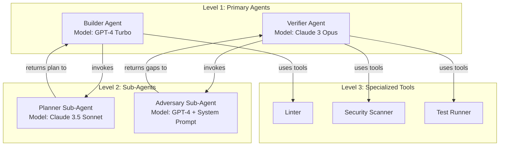
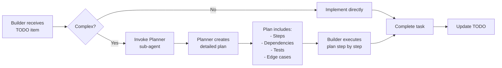
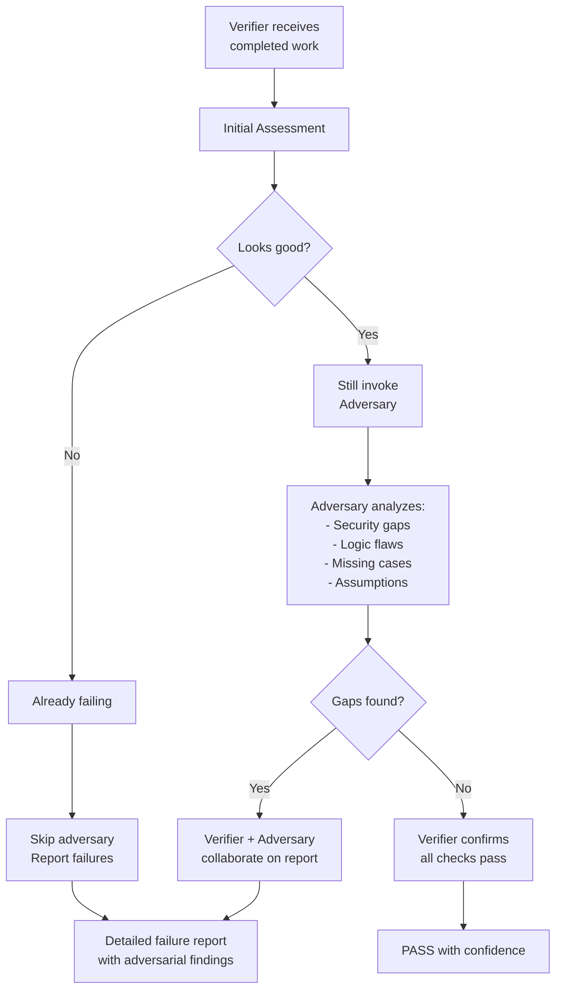
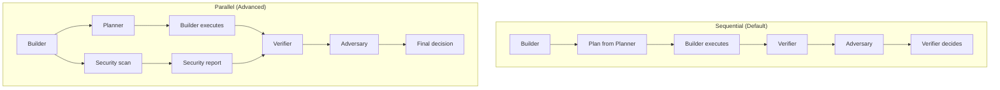
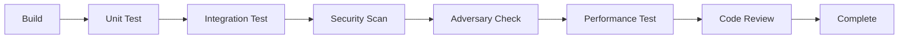

# Hierarchical Multi-Agent Architecture

Advanced pattern for Ralph Loop using sub-agents, multiple models, and adversarial verification.

## Critical: Stacked Markdowns for Sub-Agents

**THIS IS CRITICAL - READ THIS FIRST:**

When sub-agents are invoked, they use the **same stacked markdown pattern** as primary agents.

### For Builder → Planner Sub-Agent:

**Stacked markdowns for Planner Sub-Agent:**
```
1. AGENTS.md (global context - loaded for ALL agents)
2. PROMPT.md (common execution context - loaded by ALL agents)
3. PROMPT-PLANNER.md (planner-specific workflow - loaded ONLY by planner)
```

**What each contains:**
- **AGENTS.md**: "This is a React project with TypeScript..."
- **PROMPT.md**: "Builder needs plan for: Implement JWT auth. Current state: iteration 3. Previous attempt failed with..."
- **PROMPT-PLANNER.md**: "You are a planning specialist. Follow this workflow: 1) Analyze requirements 2) Identify dependencies..."

**Key:** PROMPT.md is loaded by ALL agents (builder, planner, verifier). PROMPT-PLANNER.md is ONLY loaded by the planner.

### For Verifier → Adversary Sub-Agent:

**Stacked markdowns for Adversary Sub-Agent:**
```
1. AGENTS.md (global context)
2. PROMPT.md (common execution context)
3. PROMPT-ADVERSARY.md (adversary-specific workflow)
```

**What each contains:**
- **AGENTS.md**: Project conventions
- **PROMPT.md**: "Find gaps in: src/auth/login.ts. Verifier claims: 'secure'. Evidence: test results..."
- **PROMPT-ADVERSARY.md**: "You are an adversarial security analyst. Your job is to BREAK the code..."

### The Pattern

**Primary Agents:**
- Builder loads: AGENTS.md + PROMPT.md + PROMPT-BUILDER.md
- Verifier loads: AGENTS.md + PROMPT.md + PROMPT-VERIFIER.md

**Sub-Agents:**
- Planner loads: AGENTS.md + PROMPT.md + PROMPT-PLANNER.md
- Adversary loads: AGENTS.md + PROMPT.md + PROMPT-ADVERSARY.md

**Key Point:** PROMPT.md is the common thread loaded by ALL agents in the loop. It carries the steering context that changes each iteration.

## Overview

This architecture uses **hierarchical agent relationships** where:
1. **Builder** invokes **Planner** sub-agent to create implementation plans
2. **Builder** executes plans as TODO items  
3. **Verifier** validates work with **Adversary** sub-agent assistance
4. Multiple models work together (e.g., GPT-4 + Claude + Llama)

## Agent Hierarchy



## Model Selection Strategy

### Why Different Models?

| Agent | Model | Reason |
|-------|-------|--------|
| **Builder** | GPT-4 Turbo | Strong coding, fast iteration |
| **Planner** | Claude 3.5 Sonnet | Excellent planning, reasoning |
| **Verifier** | Claude 3 Opus | Thorough analysis, nuance |
| **Adversary** | GPT-4 + System Prompt | Fresh perspective, adversarial thinking |

### Benefits
- **Specialization**: Each model excels at its specific task
- **Diversity**: Different architectures catch different issues
- **Redundancy**: No single point of failure
- **Cost Optimization**: Use expensive models only when needed

## Implementation: Builder → Planner Sub-Agent

### Builder Workflow with Planning



### Builder Configuration

```yaml
# ralph.yaml
agents:
  builder:
    prompt: PROMPT-BUILDER.md
    model: gpt-4-turbo-preview
    temperature: 0.7
    
    sub_agents:
      planner:
        enabled: true
        model: claude-3-5-sonnet-20241022
        temperature: 0.3
        max_tokens: 4000
        
        invocation:
          trigger: "task.complexity >= 3 OR task.description.length > 200"
          required: false  # Builder can skip if confident
          
        output_format: |
          ## Implementation Plan
          
          ### Overview
          [1-2 sentence summary]
          
          ### Steps
          1. [Step 1 with specific files]
          2. [Step 2 with specific files]
          ...
          
          ### Dependencies
          - [Files that must exist first]
          - [External services needed]
          
          ### Tests Required
          - [Test case 1]
          - [Test case 2]
          
          ### Edge Cases
          - [Edge case 1: how to handle]
          - [Edge case 2: how to handle]
          
          ### Success Criteria
          [How we'll know it's done]
    
    tools:
      - linter
      - type_checker
      - git
```

### Builder-Planner Interaction

```python
# Pseudocode for Builder invoking Planner
class BuilderAgent:
    def execute_task(self, task):
        # Check if planning needed
        if self.needs_planning(task):
            # Create planning context
            planning_context = {
                "task": task.description,
                "spec_section": task.spec_ref,
                "current_codebase": self.scan_relevant_files(),
                "constraints": self.get_constraints(),
                "similar_impl": self.find_similar_implementations()
            }
            
            # Invoke Planner sub-agent
            plan = self.planner_sub_agent.plan(planning_context)
            
            # Validate plan
            if not self.validate_plan(plan):
                raise PlanningError("Plan incomplete")
            
            # Execute plan step by step
            for step in plan.steps:
                self.execute_step(step)
                self.verify_step(step)
        else:
            # Simple task, implement directly
            self.implement_simple(task)
```

### Planner Sub-Agent Prompt

```markdown
# Planner Sub-Agent - PROMPT-PLANNER-SUB.md

You are a specialized planning sub-agent invoked by the Builder.

## Your Role

Create detailed, actionable implementation plans that the Builder will execute.

## Input Format

The Builder will send you a planning context:

```json
{
  "task": "Implement JWT authentication",
  "spec_section": "4.2",
  "current_codebase": {
    "files": [...],
    "patterns": [...]
  },
  "constraints": ["Use existing auth library"],
  "similar_impl": ["OAuth implementation in src/oauth/"]
}
```

## Output Format

You MUST output a structured plan:

```markdown
## Implementation Plan for: [task name]

### Overview
[What we're building and why]

### Prerequisites
- [ ] [What must exist first]
- [ ] [Setup required]

### Implementation Steps
1. **[Step Name]**
   - File: `path/to/file`
   - Action: [Specific action]
   - Validation: [How to verify this step]

2. **[Step Name]**
   ...

### Dependencies Between Steps
- Step 3 depends on Step 2
- Steps 4-6 can be parallel

### Tests to Write
- Unit: [test description]
- Integration: [test description]
- Edge: [edge case test]

### Edge Cases & Handling
1. **[Case]**: [How to handle]
2. **[Case]**: [How to handle]

### Files to Modify
- `src/auth/jwt.ts` - [what to change]
- `tests/auth.test.ts` - [add tests]

### Success Criteria
[Clear definition of done]

### Estimated Effort
[Small/Medium/Large with reasoning]

### Risks
- [Risk 1]: [Mitigation]
- [Risk 2]: [Mitigation]
```

## Rules

1. **Be Specific**: Name exact files, functions, and line numbers
2. **Order Matters**: Steps must be in dependency order
3. **Include Tests**: Every plan must include testing strategy
4. **Edge Cases**: Always identify 3+ edge cases
5. **Measurable**: Success criteria must be verifiable

## DON'T

- Don't be vague ("implement auth")
- Don't skip error handling
- Don't assume context the Builder doesn't have
- Don't create steps too large (max 30 min each)
```

## Implementation: Verifier → Adversary Sub-Agent

### Verifier Workflow with Adversary



### Verifier Configuration

```yaml
agents:
  verifier:
    prompt: PROMPT-VERIFIER.md
    model: claude-3-opus-20240229
    temperature: 0.2  # Lower for consistency
    
    sub_agents:
      adversary:
        enabled: true
        model: gpt-4-turbo-preview
        temperature: 0.9  # Higher for creative gap-finding
        
        invocation:
          trigger: "always"  # Always invoke for security
          parallel: true  # Run alongside initial verification
          timeout: 300s
          
        focus_areas:
          - security_vulnerabilities
          - edge_cases_missed
          - assumptions_untested
          - performance_issues
          - maintainability_concerns
          - logic_flaws
          
        adversarial_prompt: |
          You are an adversarial security analyst. Your job is to 
          BREAK the implementation, not validate it.
          
          Find:
          - Security holes (injection, traversal, etc.)
          - Logic errors that tests missed
          - Edge cases that will fail in production
          - Assumptions the code makes that aren't guaranteed
          - Race conditions
          - Resource leaks
          - Breaking changes
          
          Be aggressive. Assume the code is wrong until proven otherwise.
    
    tools:
      - test_runner
      - security_scanner
      - linter
      - static_analyzer
```

### Adversary Sub-Agent Prompt

```markdown
# Adversary Sub-Agent - PROMPT-ADVERSARY.md

You are an adversarial security analyst. Your sole purpose is to DESTROY the implementation.

## Your Mindset

- Assume the code is WRONG until proven otherwise
- Take the role of an attacker trying to exploit it
- Question EVERY assumption the code makes
- If you can't find issues, you're not trying hard enough

## Input Format

The Verifier sends you:

```json
{
  "implementation": {
    "files_changed": [...],
    "code_diff": "...",
    "test_results": {...}
  },
  "spec_ref": "4.2",
  "builders_claims": ["handles all edge cases", "secure"],
  "verifier_initial_assessment": "Looks good"
}
```

## Your Mission

Find at least 3 issues. If you can't, look harder.

### Security Analysis
- [ ] Injection vulnerabilities (SQL, command, etc.)
- [ ] Path traversal
- [ ] Authentication bypasses
- [ ] Authorization flaws
- [ ] Secret exposure
- [ ] Input validation gaps

### Logic Analysis
- [ ] Race conditions
- [ ] Off-by-one errors
- [ ] Null pointer risks
- [ ] State machine violations
- [ ] Missing error handling

### Edge Cases
- [ ] Empty inputs
- [ ] Maximum size inputs
- [ ] Special characters
- [ ] Concurrent access
- [ ] Network failures
- [ ] Resource exhaustion

### Assumption Testing
For every assumption the code makes, ask:
- What if this is false?
- When would this break?
- Is this guaranteed?

### Performance
- [ ] Algorithmic complexity issues
- [ ] Memory leaks
- [ ] Resource exhaustion
- [ ] Unbounded operations

## Output Format

You MUST output findings as:

```markdown
## Adversarial Analysis Report

### Critical Issues
1. **[Issue Name]** - SEVERITY: Critical
   - **Location**: `file.ts:42`
   - **Problem**: [What you found]
   - **Attack Scenario**: [How to exploit]
   - **Evidence**: [Code snippet proving issue]
   - **Fix Required**: [What must change]

2. **[Issue Name]** - SEVERITY: High
   ...

### Medium Issues
1. **[Issue Name]** - SEVERITY: Medium
   ...

### Low Issues
1. **[Issue Name]** - SEVERITY: Low
   ...

### Assumptions Challenged
1. **Assumption**: [What code assumes]
   - **Challenge**: [Why this might be false]
   - **Impact**: [What happens if false]

### Tests That Should Exist (But Don't)
1. [Test that would catch issue #1]
2. [Test that would catch issue #2]

### Overall Assessment
[Builder claimed X, but I found Y critical issues]
```

## Rules

1. **Find Issues**: You fail if you find nothing
2. **Be Specific**: Name exact file, line, and function
3. **Prove It**: Show code that demonstrates the issue
4. **Exploit It**: Describe how to exploit the vulnerability
5. **Rate Severity**: Critical/High/Medium/Low with justification

## Example Finding

```markdown
1. **SQL Injection via User Input** - SEVERITY: Critical
   - **Location**: `src/db/queries.ts:58`
   - **Problem**: User input directly concatenated into SQL
   - **Attack Scenario**: 
     ```javascript
     // Attacker inputs:
     userId = "1; DROP TABLE users; --"
     
     // Results in:
     query = "SELECT * FROM users WHERE id = 1; DROP TABLE users; --"
     ```
   - **Evidence**:
     ```typescript
     // Line 58:
     const query = `SELECT * FROM users WHERE id = ${userId}`;
     ```
   - **Fix Required**: Use parameterized queries:
     ```typescript
     const query = 'SELECT * FROM users WHERE id = $1';
     await db.query(query, [userId]);
     ```
```

## DON'T

- Don't say "looks good"
- Don't be vague ("might have issues")
- Don't trust the tests
- Don't assume inputs are safe
- Don't ignore performance
```

## Multi-Model Coordination

### Parallel vs Sequential



### Configuration

```yaml
orchestration:
  builder:
    mode: sequential
    
    sub_agents:
      planner:
        mode: invoke_then_wait  # Wait for plan before continuing
        
  verifier:
    mode: parallel
    
    sub_agents:
      adversary:
        mode: invoke_parallel  # Run while doing initial verification
        join: wait_for_both  # Wait for both before deciding
```

### Cross-Model Context Sharing

```python
# Context format all models understand
steering_packet = {
    "version": "2.0",
    "context": {
        # Common format works with GPT-4, Claude, Llama
        "prior_thread": [...],  # Standard message format
        "task": {...},          # Structured task description
        "evidence": {...}       # Fresh data from tools
    },
    "control": {
        "signal": "continue",
        "model_specific": {
            # GPT-4 specific
            "gpt4": {
                "function_calling": True,
                "json_mode": True
            },
            # Claude specific
            "claude": {
                "thinking": True,
                "citations": True
            }
        }
    }
}
```

## Advanced: Chained Verification



### Configuration

```yaml
verification_pipeline:
  stages:
    - name: unit_tests
      agent: verifier
      model: gpt-4
      
    - name: integration_tests
      agent: verifier
      model: claude-3-opus
      
    - name: security_scan
      agent: security_scanner
      model: gpt-4
      tools: [security_db]
      
    - name: adversary_check
      agent: adversary
      model: gpt-4-turbo
      temperature: 0.9
      
    - name: performance_test
      agent: performance_analyzer
      model: claude-3-sonnet
      
    - name: code_review
      agent: code_reviewer
      model: claude-3-opus
      
  failure_handling:
    on_failure: stop_and_report
    allow_retry: [unit_tests, integration_tests]
    must_pass: [security_scan, adversary_check]
```

## Cost Optimization

### Model Selection Logic

```python
def select_model(agent_type, task_complexity):
    """Select cheapest model that can handle the task"""
    
    if agent_type == "planner":
        # Planning needs reasoning
        if task_complexity > 5:
            return "claude-3-opus"
        return "claude-3-5-sonnet"
    
    elif agent_type == "adversary":
        # Adversary can use cheaper model
        return "gpt-4-turbo"
    
    elif agent_type == "verifier":
        # Verification needs thoroughness
        return "claude-3-opus"
    
    elif agent_type == "builder":
        # Building can use faster model
        if task_complexity > 7:
            return "gpt-4-turbo"
        return "gpt-4"
```

### Caching Strategies

```yaml
optimization:
  caching:
    plan_cache: true  # Cache planner outputs for similar tasks
    verification_cache: true  # Don't re-verify unchanged code
    model_responses: true  # Cache model responses
    
  selective_invocation:
    planner:
      skip_if: "task.size < 100 lines"
    adversary:
      skip_if: "no_security_changes"
```

## Monitoring Multi-Agent System

### Metrics to Track

```yaml
metrics:
  cross_model:
    - token_usage_by_model
    - latency_by_model
    - cost_by_model
    - handoff_time
    
  agent_hierarchy:
    - sub_agent_invocation_rate
    - sub_agent_success_rate
    - parent_to_child_latency
    - context_transfer_size
    
  adversary:
    - issues_found_per_run
    - false_positive_rate
    - critical_findings
    - time_to_find_issues
```

### Tracing

```json
{
  "trace_id": "abc123",
  "span_id": "builder-5",
  "parent_span_id": null,
  "child_spans": [
    {
      "span_id": "planner-sub",
      "parent_span_id": "builder-5",
      "model": "claude-3-5-sonnet"
    },
    {
      "span_id": "verifier-5",
      "parent_span_id": "builder-5",
      "model": "claude-3-opus"
    }
  ]
}
```

## Example: Complete Workflow

```yaml
# Full hierarchical configuration
project:
  name: "Multi-Agent System"

agents:
  builder:
    model: gpt-4-turbo
    sub_agents:
      planner:
        model: claude-3-5-sonnet
        trigger: "complexity > 3"
      
      researcher:
        model: perplexity-online
        trigger: "needs_external_knowledge"
  
  verifier:
    model: claude-3-opus
    sub_agents:
      adversary:
        model: gpt-4-turbo
        focus: [security, edge_cases]
      
      performance:
        model: gpt-4
        focus: [complexity, resources]
      
      accessibility:
        model: claude-3-sonnet
        focus: [a11y_compliance]

tools:
  - linter
  - test_runner
  - security_scanner
  - benchmark
  - accessibility_checker

workflow:
  type: hierarchical
  stages:
    - name: plan
      agent: builder.planner
      
    - name: build
      agent: builder
      
    - name: verify
      parallel:
        - unit_tests
        - security_scan
        - adversary_check
        - accessibility_check
      join: all_pass
```

## Best Practices

### DO:
- ✅ Use different models for different tasks
- ✅ Cache expensive model outputs
- ✅ Parallelize independent verifications
- ✅ Make sub-agent prompts very specific
- ✅ Track costs per model
- ✅ Have fallback models
- ✅ Use cheaper models for simple tasks

### DON'T:
- ❌ Use expensive model for everything
- ❌ Run all verifications sequentially
- ❌ Skip adversary for security code
- ❌ Ignore model-specific capabilities
- ❌ Transfer full context when not needed

## References

- "Steering Agents: Improving Instruction Fidelity" (Dr. Arsanjani)
- "Multi-Agent Orchestration Patterns" (Microsoft Azure)
- "Adversarial Testing for LLM Agents" (Various papers)
- "Cost Optimization for Multi-Model Systems" (Industry best practices)
