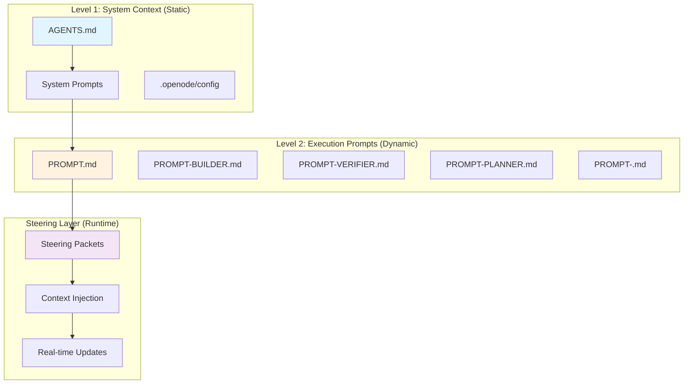
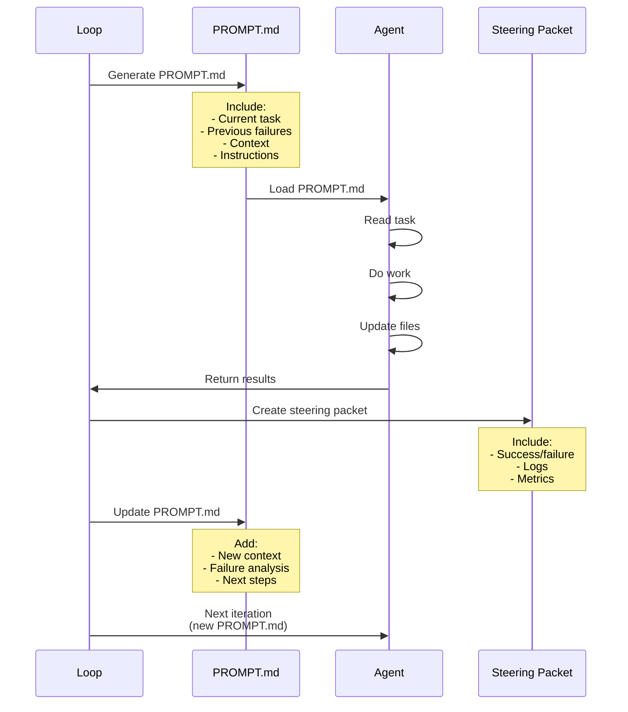

# Ralph Loop Prompt Architecture

## Critical Two-Level System - READ THIS FIRST

Ralph Loop uses a **critical two-level prompt architecture** with **stacked markdowns**. Getting this wrong breaks the entire system.

## The Separation

**Level 1: System Context (WHO the agent is)**
- **AGENTS.md** - Global project context (conventions, tech stack, how to run)
- **System Prompts** - Per-agent identity (loaded from `.opencode/agents/` or config)
- **These are STATIC** - Don't modify during execution
- **Loaded automatically** - Always present

**Level 2: Execution Steering (WHAT the agent does)**
- **PROMPT.md** - Loaded by ALL agents (common execution context)
- **PROMPT-BUILDER.md** - Loaded ONLY by builder (builder-specific workflow)
- **PROMPT-VERIFIER.md** - Loaded ONLY by verifier (verifier-specific workflow)
- **PROMPT-<name>.md** - Loaded ONLY by that agent role
- **These are STEERING PROMPTS** - Modified each iteration to guide execution
- **Stacked together** - All relevant prompts loaded for each agent

## How Stacked Markdowns Work

**AGENTS.md is always loaded for every agent.**

**Then, stacked based on agent role:**

```
Builder Agent loads:
  1. AGENTS.md (global)
  2. PROMPT.md (common execution context)
  3. PROMPT-BUILDER.md (builder workflow)

Verifier Agent loads:
  1. AGENTS.md (global)
  2. PROMPT.md (common execution context)
  3. PROMPT-VERIFIER.md (verifier workflow)
```

**Key Point:** PROMPT.md is loaded by ALL agents. PROMPT-<name>.md is specific to that agent.

## Why This Matters

**You steer by modifying PROMPT.md and PROMPT-<name>.md files, NOT system prompts.**

- System prompt = "You are a skilled software engineer" (identity - DON'T CHANGE)
- PROMPT.md = "Current loop state: Task 5, iteration 3, last failed..." (steering - CHANGE EACH ITERATION)
- PROMPT-BUILDER.md = "Builder workflow: Discovery → Planning → Implementation" (steering guide - OCCASIONALLY UPDATE)

**If you modify system prompts, you change WHO the agent is.**
**If you modify PROMPT*.md files, you steer WHAT the agent does.**

## Prompt Hierarchy



## Level 1: System Context (Always Loaded)

### AGENTS.md (Global Context)

**Location:** Project root  
**Purpose:** Global project context for ALL agents  
**When Loaded:** Always, on every invocation  
**Content:**
- Project overview and goals
- Tech stack and dependencies
- File structure conventions
- How to run/build/test
- Code style guidelines
- Project-specific conventions

**Example AGENTS.md:**
```markdown
# AGENTS.md

## Project Overview
This is a React + TypeScript e-commerce application.

## Tech Stack
- Frontend: React 18, TypeScript, TailwindCSS
- Backend: Node.js, Express, PostgreSQL
- Testing: Jest, React Testing Library
- Build: Vite

## File Structure
src/
├── components/     # Reusable UI components
├── pages/         # Route-level components
├── hooks/         # Custom React hooks
├── utils/         # Utility functions
└── types/         # TypeScript types

## Conventions
- Components: PascalCase (Button.tsx)
- Utils: camelCase (formatDate.ts)
- Tests: *.test.ts alongside source files
- Use functional components with hooks

## Commands
- npm run dev       # Start dev server
- npm run test      # Run tests
- npm run build     # Production build
- npm run lint      # Run ESLint
```

### System Prompts (Per Agent)

**Location:** `.opencode/agents/` or configured in OpenCode  
**Purpose:** Define agent's fundamental role and behavior  
**When Loaded:** On every agent invocation  
**Content:**
- Agent identity and personality
- Core capabilities and constraints
- Response format preferences
- Tool usage guidelines

**Example Builder System Prompt:**
```markdown
You are a skilled software engineer specializing in React and TypeScript.

Your role:
- Implement features following best practices
- Write clean, maintainable code
- Add comprehensive tests
- Follow project conventions from AGENTS.md

Guidelines:
- Always check AGENTS.md first
- Write tests before or alongside implementation
- Handle edge cases gracefully
- Use TypeScript strict mode
- Prefer functional components
```

**Example Verifier System Prompt:**
```markdown
You are a quality assurance engineer specializing in code review.

Your role:
- Verify implementations meet requirements
- Check for bugs, security issues, and edge cases
- Ensure tests are comprehensive
- Validate against project conventions

Guidelines:
- Be thorough but constructive
- Cite specific issues with line numbers
- Suggest improvements, don't just criticize
- Check AGENTS.md for project standards
```

## Level 2: Execution Prompts (Dynamic)

### PROMPT.md (Main Execution Prompt)

**Location:** Project root (same directory as ralph-loop.py)  
**Purpose:** Current execution context and task details  
**When Loaded:** At start of each phase/iteration  
**Can Be Modified:** YES - this is where steering happens  
**Content:**
- Current task from TODO.md
- Specific instructions for this run
- Context from previous iterations
- Real-time adjustments

**PROMPT.md is part of the steering packet architecture** - it carries the dynamic execution context that changes based on:
- Which TODO item is being worked on
- Previous iteration results
- Failure history
- Current workflow state

**Example PROMPT.md (dynamically generated):**
```markdown
# Current Execution Context

## Active Task
- **TODO Item:** #5 - Implement JWT authentication
- **Status:** In Progress
- **Iteration:** 3
- **Previous Attempts:** 2 failures

## Context
- **SPEC Reference:** Section 4.2
- **Files Changed:** src/auth/login.ts
- **Tests:** 3 passing, 2 failing

## Previous Attempt Analysis
**Attempt 2 Failure:**
- Error: Token validation fails on edge case
- Root cause: Missing null check
- Location: src/auth/jwt.ts:42

## Current Instructions
**Primary Goal:** Fix null pointer in JWT validation

**Specific Requirements:**
1. Add null check before token validation
2. Update existing tests to cover null case
3. Ensure backward compatibility

**Success Criteria:**
- [ ] All auth tests pass (including edge cases)
- [ ] No TypeScript errors
- [ ] Security scan passes

## Evidence from Previous Runs
- Test output: "Cannot read property 'split' of null"
- Failed on: Empty token string
- Stack trace: src/auth/jwt.ts:42:15

## Next Steps
1. Locate null check location
2. Add defensive programming
3. Run tests
4. Update TODO.md
```

### PROMPT-<name>.md (Specialized Prompts)

**Location:** Project root or `.ralph/prompts/`  
**Purpose:** Detailed workflows for specific agents/phases  
**When Loaded:** When specific agent is invoked  
**Can Be Modified:** Minimal - these are templates  
**Content:**
- Agent-specific workflow diagrams (mermaid)
- Decision trees
- Step-by-step procedures
- Common scenarios and solutions
- Output formats

**These files are STEERING GUIDES** - they help agents understand the flow but are NOT modified during execution.

## How It Works in Practice

### CLI Execution Flow

```bash
# 1. User runs loop
opencode run --agent builder

# 2. OpenCode loads:
#    - AGENTS.md (always)
#    - Builder system prompt (from config)
#    - PROMPT.md (current execution context)

# 3. Builder reads PROMPT.md to understand:
#    - Which TODO item to work on
#    - What failed before
#    - Current context

# 4. Builder may load PROMPT-BUILDER.md for:
#    - Workflow diagrams
#    - Decision trees
#    - How to handle edge cases

# 5. Builder does work, updates files

# 6. Loop updates PROMPT.md for next iteration:
#    - New context
#    - Updated TODO status
#    - New failure information
```

### HTTP Server Execution

```bash
# Start HTTP server
opencode server --port 8080

# POST /run with steering packet
{
  "agent": "builder",
  "prompt_file": "PROMPT.md",
  "system_context": "AGENTS.md",
  "steering": {
    "signal": "continue",
    "task_id": "task-5",
    "iteration": 3
  }
}

# Server response includes:
# - Agent output
# - Updated PROMPT.md suggestions
# - Next steering recommendation
```

### Claude/Cursor Integration

```javascript
// Using Claude Code or Cursor
const response = await claude.run({
  system: loadFile('AGENTS.md'),           // Global context
  prompt: loadFile('PROMPT.md'),          // Execution context
  additionalContext: loadFile('PROMPT-BUILDER.md'), // Workflow guide
  
  // Steering packet as metadata
  metadata: {
    iteration: 3,
    phase: 'building',
    task_id: 'task-5'
  }
});
```

## The Steering Mechanism

### PROMPT.md as Steering Vehicle



### Key Principle

**You DON'T modify:**
- AGENTS.md (global context stays constant)
- System prompts (agent identity is fixed)
- PROMPT-BUILDER.md (workflow guide is static)

**You DO modify:**
- PROMPT.md (execution context changes each iteration)
- This is how you steer the agent without changing its identity

## File Locations

### Standard Structure

```
my-project/
├── AGENTS.md                    # Global context (ALWAYS loaded)
├── PROMPT.md                    # Execution context (steered)
├── PROMPT-BUILDER.md            # Builder workflow guide
├── PROMPT-VERIFIER.md           # Verifier workflow guide
├── PROMPT-PLANNER.md            # Planner workflow guide
├── PROMPT-ADVERSARY.md          # Adversary workflow guide
│
├── ralph-loop.py                # Loop runner
├── ralph.yaml                   # Configuration
│
├── .ralph/                      # Loop state
│   ├── loop-state.yaml
│   ├── prompts/                 # Optional: prompt templates
│   │   └── custom-agent.md
│   └── logs/
│
├── .opencode/                   # OpenCode config
│   └── agents/
│       ├── builder.md           # Builder system prompt
│       ├── verifier.md          # Verifier system prompt
│       └── planner.md           # Planner system prompt
│
└── src/                         # Your code
```

### Alternative: Same Directory

Some teams prefer all prompts in one place:

```
my-project/
├── AGENTS.md
├── PROMPT.md
├── PROMPT-*.md                  # All specialized prompts
├── ralph-loop.py
└── src/
```

## Configuration

### Configuring Prompt Locations

```yaml
# ralph.yaml
prompts:
  # System context (Level 1)
  global_context:
    file: AGENTS.md
    required: true
    
  # Execution prompts (Level 2)
  main:
    file: PROMPT.md
    generated: true  # Dynamically updated
    location: root   # or .ralph/prompts/
    
  specialized:
    builder: PROMPT-BUILDER.md
    verifier: PROMPT-VERIFIER.md
    planner: PROMPT-PLANNER.md
    adversary: PROMPT-ADVERSARY.md
    
  # Dynamic generation
  generation:
    template: |
      # Current Execution Context
      
      ## Active Task
      - **TODO Item:** {{task.id}}
      - **Status:** {{task.status}}
      - **Iteration:** {{iteration.count}}
      
      ## Context
      {{context.prior_thread}}
      
      ## Instructions
      {{task.instructions}}
      
      ## Evidence
      {{evidence.test_results}}
      
      ## Next Steps
      {{plan.next_steps}}
```

### OpenCode Integration

```json
// .opencode/config.json
{
  "agents": {
    "builder": {
      "system_prompt": "AGENTS.md",
      "execution_prompt": "PROMPT.md",
      "workflow_prompt": "PROMPT-BUILDER.md"
    },
    "verifier": {
      "system_prompt": "AGENTS.md",
      "execution_prompt": "PROMPT.md",
      "workflow_prompt": "PROMPT-VERIFIER.md"
    }
  }
}
```

## Best Practices

### DO:

✅ **Keep AGENTS.md stable**
- Only update when project structure changes
- Don't modify during loop execution

✅ **Modify PROMPT.md dynamically**
- Update after every iteration
- Include failure analysis
- Add fresh evidence
- Clear next steps

✅ **Use PROMPT-*.md for workflows**
- Include mermaid diagrams
- Document decision trees
- Provide templates

✅ **Steer via PROMPT.md, not system prompts**
- System prompts = identity (don't change)
- PROMPT.md = execution context (do change)

✅ **Include context in PROMPT.md**
- Previous failures
- Current state
- Specific line numbers
- Test output

### DON'T:

❌ **Modify system prompts during loop**
- Agent identity should be consistent
- Don't change "who" the agent is

❌ **Make PROMPT-BUILDER.md dynamic**
- Workflow guides are static
- Only PROMPT.md changes

❌ **Skip AGENTS.md**
- Always loaded first
- Critical context

❌ **Put everything in one file**
- Separate concerns:
  - AGENTS.md = global
  - PROMPT.md = execution
  - PROMPT-*.md = workflows

## Common Mistakes

### Mistake 1: Confusing System vs Execution

**Wrong:**
```markdown
# PROMPT-BUILDER.md (should be static)
Current task: Implement login
Previous failure: Null pointer
```

**Right:**
```markdown
# PROMPT.md (execution context)
Current task: Implement login
Previous failure: Null pointer

# PROMPT-BUILDER.md (static workflow)
You are a builder agent.
Follow these phases: Discovery → Planning → Implementation
```

### Mistake 2: Modifying System Identity

**Wrong:**
```markdown
# In system prompt during loop:
"You are now focused on fixing the null pointer issue..."
```

**Right:**
```markdown
# System prompt stays:
"You are a skilled software engineer..."

# PROMPT.md changes:
"Your current task: Fix null pointer at line 42"
```

### Mistake 3: No Steering Context

**Wrong:**
```markdown
# PROMPT.md
Implement authentication.
```

**Right:**
```markdown
# PROMPT.md
Task: Implement JWT authentication
Previous: 2 failures on token validation
Context: SPEC section 4.2
Evidence: Error "Cannot read property 'split' of null"
Focus: Add null check before line 42
```

## Claude Code Example

```javascript
// Using Claude Code with Ralph Loop

// 1. System prompt (constant)
const systemPrompt = `
You are a software engineer. 
Always check AGENTS.md for project context.
`;

// 2. Load execution context
const promptMd = readFile('PROMPT.md');
// Contains current task, failures, evidence

// 3. Run Claude
const response = await claude.run({
  system: systemPrompt,
  prompt: promptMd,
  
  // Additional context
  additionalContext: [
    readFile('AGENTS.md'),
    readFile('PROMPT-BUILDER.md')  // Workflow guide
  ]
});

// 4. Update PROMPT.md for next iteration
writeFile('PROMPT.md', updatePrompt(response));
```

## OpenCode Integration

### Standard CLI Execution

```bash
# Run builder agent
opencode run --agent builder

# What happens:
# 1. OpenCode loads AGENTS.md (global context)
# 2. OpenCode loads builder system prompt (.opencode/agents/builder.md)
# 3. Ralph Loop generates PROMPT.md (execution context)
# 4. Builder reads PROMPT.md and does work
# 5. Loop updates PROMPT.md for next iteration
```

### HTTP Server Mode

```bash
# Start OpenCode HTTP server
opencode server --port 8080

# POST /run
{
  "agent": "builder",
  "system": "AGENTS.md",           // Level 1: Global context
  "prompt": "PROMPT.md",           // Level 2: Execution context  
  "workflow": "PROMPT-BUILDER.md", // Workflow guide
  "steering": {
    "signal": "continue",
    "task_id": "task-5",
    "iteration": 3
  }
}

# Response includes:
# - Agent output
# - Suggested PROMPT.md updates
# - Next steering recommendation
```

### Using Claude Code

```javascript
// Using Claude Code with Ralph Loop
const result = await claude.run({
  system: [
    readFile('AGENTS.md'),               // Global context
    readFile('.opencode/agents/builder.md')  // Builder identity
  ].join('\n\n'),
  
  prompt: readFile('PROMPT.md'),         // Execution context (steered)
  
  additionalContext: [
    readFile('PROMPT-BUILDER.md'),       // Workflow guide
    readFile('SPEC.md')                  // Requirements
  ]
});

// Update steering for next iteration
writeFile('PROMPT.md', generateNextPrompt(result));
```

### Using Cursor

```javascript
// Cursor with Ralph Loop
const response = await cursor.agent({
  name: 'builder',
  
  systemPrompt: load('AGENTS.md') + '\n\n' + 
                load('.cursor/agents/builder.md'),
  
  executionPrompt: generatePromptMd({
    task: currentTask,
    iteration: loopState.iteration,
    failures: loopState.failureHistory
  }),
  
  workflowPrompt: load('PROMPT-BUILDER.md')
});
```

## File Locations Summary

```
my-project/
├── AGENTS.md                    ← Level 1: Global context (ALWAYS)
│                                  (project conventions, tech stack)
│
├── .opencode/
│   └── agents/
│       ├── builder.md           ← Level 1: Builder identity
│       ├── verifier.md          ← Level 1: Verifier identity
│       └── planner.md           ← Level 1: Planner identity
│
├── PROMPT.md                    ← Level 2: Execution (STEERED)
│                                  (current task, failures, evidence)
│                                  (MODIFIED each iteration)
│
├── PROMPT-BUILDER.md            ← Level 2: Workflow guide (static)
├── PROMPT-VERIFIER.md           ← Level 2: Workflow guide (static)
├── PROMPT-PLANNER.md            ← Level 2: Workflow guide (static)
│
├── ralph-loop.py                ← Loop runner
└── src/                         ← Your code
```

## Critical Reminders

### DO:
✅ **Modify PROMPT.md each iteration**
- Update with current task
- Include failure analysis
- Add fresh evidence
- Clear next steps

✅ **Keep AGENTS.md stable**
- Only update when project changes
- Never during loop execution

✅ **Keep system prompts constant**
- Define agent identity
- Don't change during execution

✅ **Use PROMPT-*.md for workflows**
- Mermaid diagrams
- Decision trees
- Static guides

### DON'T:
❌ **Never modify system prompts during loop**
- Changes agent identity
- Breaks consistency

❌ **Never put dynamic content in PROMPT-BUILDER.md**
- Workflow guides are static
- Only PROMPT.md changes

❌ **Never skip AGENTS.md**
- Critical global context
- Always loaded first

## References

- "Steering Agents: Improving Instruction Fidelity" (Dr. Arsanjani)
- "Multi-Turn Prompts Explained" (Glean)
- "System Message Design" (Microsoft Azure)
- OpenCode Documentation
- Claude Code Documentation
- Cursor Documentation
