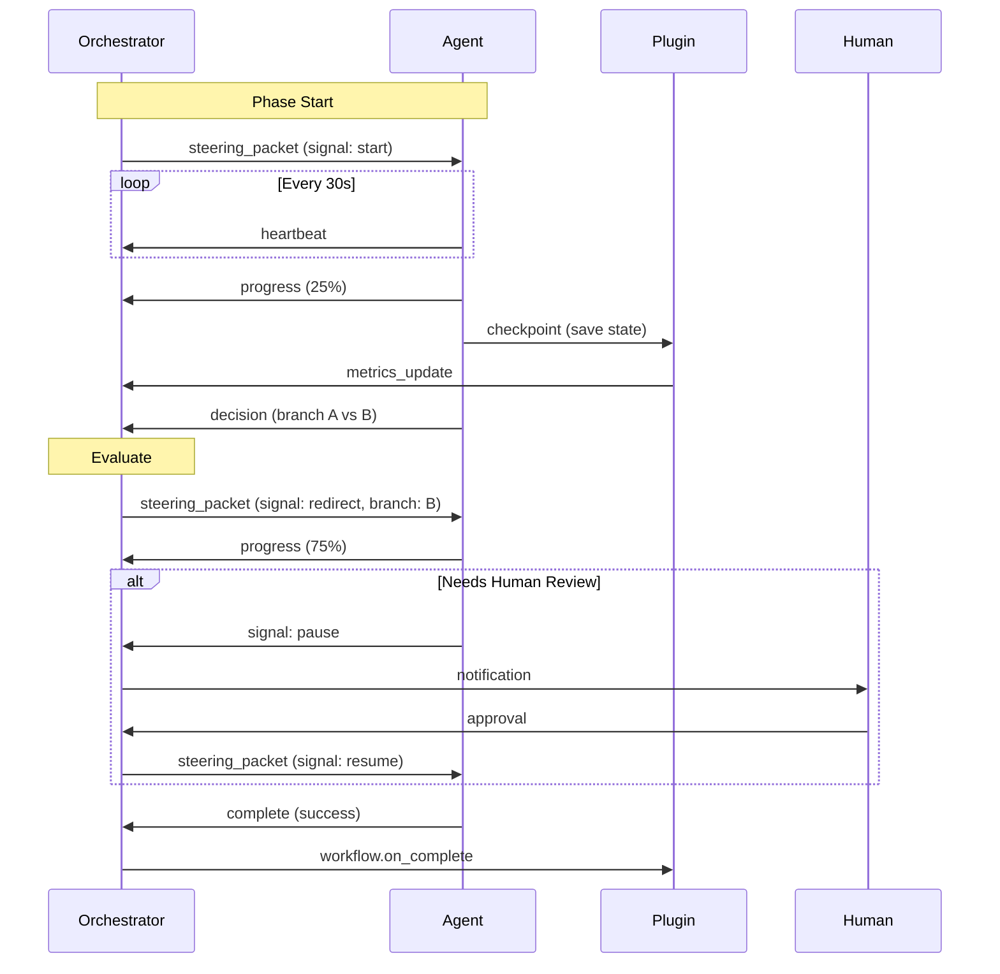
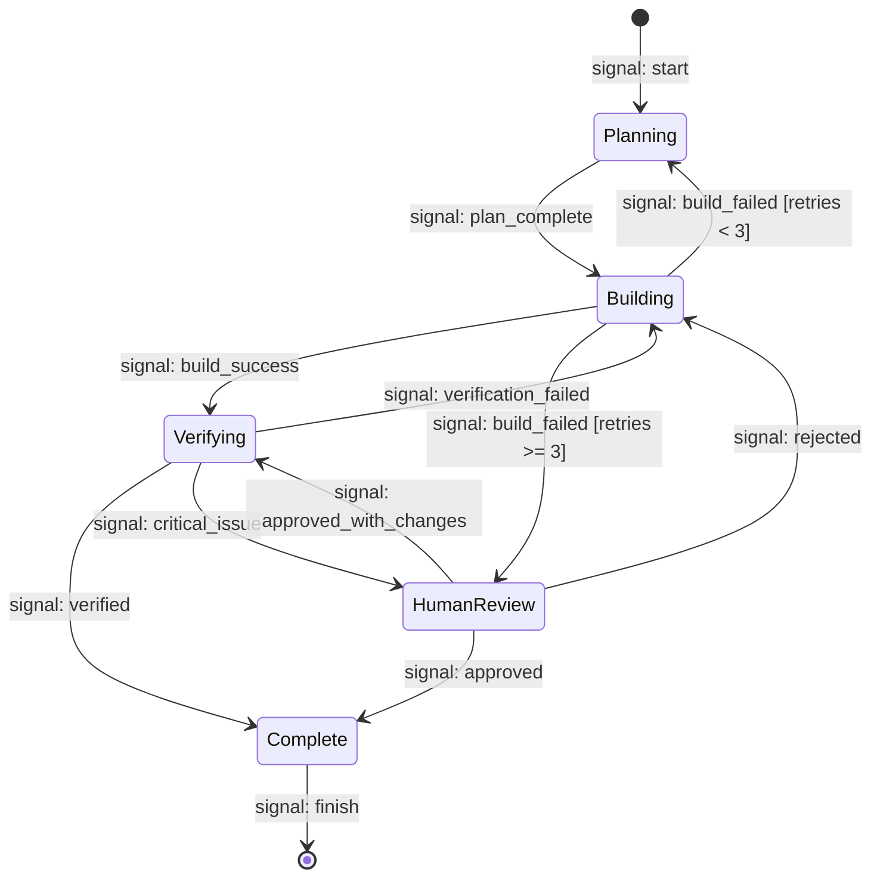
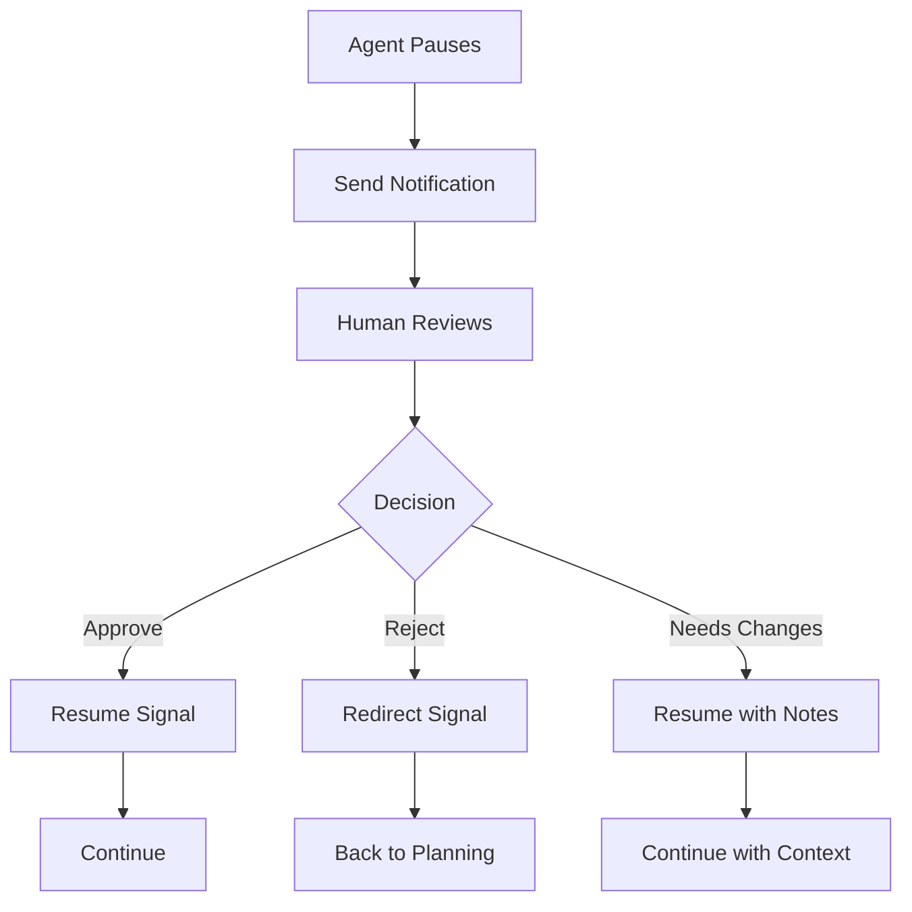

# Steering Packets in Ralph Loop

Steering packets are the core architectural pattern that enables real-time control of AI agent workflows in Ralph Loop.

## Overview

Based on research from Microsoft Azure, AWS Step Functions, Ably realtime systems, and AI orchestration frameworks, Ralph Loop implements **steering packets** as structured state messages that carry workflow context, agent instructions, control signals, and fresh evidence.

## Research Foundation

**Key Sources:**
1. **Microsoft Azure** - State machines in AI conversations with dynamic transitions
2. **AWS Step Functions** - State machine data handling and transitions
3. **Ably Realtime** - Low-latency control signals for steering
4. **Scale AI** - State machines for structured, stateful workflows
5. **AWS Strands** - Steering agents for modern workflows
6. **ArXiv SAGE** - State-action representations for steering

**Academic/Industry Papers:**
- "PDF Towards Fully-Controllable Packet Steering for AI Backend Networks" (Microsoft Research)
- "Congestion Control for AI Workloads with Message-Level Signaling"
- "SAGE: Steering Dialog Generation with Future-Aware State-Action"

## Steering Packet Architecture

### Structure

```json
{
  "version": "2.0",
  "timestamp": "2024-03-08T10:30:15Z",
  "trace_id": "abc123-def456",
  
  "workflow": {
    "name": "default",
    "iteration": 5,
    "phase": "building",
    "state": "active",
    "started_at": "2024-03-08T10:00:00Z"
  },
  
  "control": {
    "signal": "continue",
    "priority": "normal",
    "timeout": 7200,
    "can_interrupt": true,
    "can_redirect": true
  },
  
  "context": {
    "prior_thread": [...],
    "current_task": {...},
    "completed_tasks": [...],
    "failure_history": [...]
  },
  
  "evidence": {
    "files_changed": [...],
    "test_results": {...},
    "logs": [...],
    "metrics": {...}
  },
  
  "instructions": {
    "primary": "...",
    "constraints": [...],
    "success_criteria": [...],
    "next_steps": [...]
  }
}
```

### Control Signals

**Signal Types:**

1. **continue** - Normal execution
   ```json
   {"signal": "continue", "priority": "normal"}
   ```

2. **interrupt** - Stop immediately
   ```json
   {"signal": "interrupt", "reason": "Human override", "preserve_context": true}
   ```

3. **redirect** - Change direction
   ```json
   {"signal": "redirect", "new_phase": "planning", "reason": "Flawed approach"}
   ```

4. **pause** - Wait for external input
   ```json
   {"signal": "pause", "wait_for": "human_approval", "timeout": 86400}
   ```

5. **resume** - Continue from checkpoint
   ```json
   {"signal": "resume", "from_checkpoint": "iteration-5"}
   ```

6. **heartbeat** - Health check
   ```json
   {"signal": "heartbeat", "status": "healthy", "progress": 0.75}
   ```

7. **checkpoint** - Save state
   ```json
   {"signal": "checkpoint", "state_data": {...}, "location": ".ralph/snapshots/"}
   ```

8. **decision** - Branch point reached
   ```json
   {"signal": "decision", "options": ["A", "B", "C"], "recommendation": "B"}
   ```

9. **error** - Failure with context
   ```json
   {"signal": "error", "error_type": "TimeoutError", "recoverable": true}
   ```

10. **complete** - Task finished
    ```json
    {"signal": "complete", "success": true, "artifacts": [...]}
    ```

## Message-Level Signaling

### Signal Flow



### Signal Timing

**Signal Intervals:**
- Heartbeat: Every 30 seconds
- Progress: Every 10% completion
- Checkpoint: Every 60 seconds or at milestones
- Decision: At branch points

## State Machine Integration

### State Transitions

Steering packets enable explicit state transitions:



### Transition Guards

Guards are conditions evaluated before allowing transition:

```yaml
transitions:
  - from: building
    to: verifying
    guard: 
      expression: "tests_passed AND build_successful"
      timeout: 300s
    on_failure: 
      action: retry
      max_attempts: 3
```

## Real-Time Steering

### Low-Latency Control

Based on Ably's research on realtime steering:

**Requirements:**
1. **Low Latency**: < 100ms signal delivery
2. **Reliable Delivery**: At-least-once semantics
3. **Ordered Delivery**: Signals processed in sequence
4. **Backpressure**: Handle signal overflow

**Implementation:**
- WebSocket connections for real-time
- Circuit breaker on signal path
- Signal queue with prioritization
- Acknowledgment mechanism

### Barge-In Capability

Users can redirect agents mid-execution:

```python
# User sends interrupt signal
steering_packet = {
    "control": {
        "signal": "interrupt",
        "reason": "Wrong approach",
        "new_direction": "planning"
    },
    "context": {
        "preserve": True,  # Keep all context
        "checkpoint": "pre_build"
    }
}

# Agent receives and handles
if packet.control.signal == "interrupt":
    current_task.cancel(preserve_context=True)
    transition_to(packet.control.new_direction)
```

## Human-in-the-Loop

### Pause and Resume

```yaml
human_review:
  trigger: 
    condition: "failure_count >= 3 OR critical_error"
  
  steering:
    signal: pause
    notification:
      slack: "@here Review needed"
      email: ["lead@company.com"]
  
  wait_for:
    - human_approval
    - timeout: 86400s
  
  resume_options:
    - approve: continue to next phase
    - reject: back to planning
    - approve_with_changes: continue with notes
```

### Approval Flow



## Circuit Breaker Integration

### Signal-Level Circuit Breaker

Prevent cascade failures by circuit breaking at signal level:

```yaml
circuit_breaker:
  signal_types:
    error:
      threshold: 5
      timeout: 300s
      half_open_max: 3
    
    heartbeat:
      threshold: 3  # Missed heartbeats
      timeout: 60s
  
  on_open:
    action: pause_workflow
    notify: ["@oncall"]
  
  on_close:
    action: resume_workflow
    resume_from: last_checkpoint
```

### Signal Patterns

**Healthy Pattern:**
```
start -> heartbeat(30s) -> progress(25%) -> checkpoint -> 
progress(50%) -> heartbeat(60s) -> progress(75%) -> complete
```

**Degraded Pattern:**
```
start -> heartbeat(30s) -> error(recoverable) -> retry -> 
heartbeat(60s) -> progress(50%) -> complete
```

**Failed Pattern:**
```
start -> heartbeat(30s) -> error(critical) -> 
retry -> error(critical) -> retry -> error(critical) -> 
circuit_breaker_open -> pause_for_human
```

## Monitoring and Observability

### Signal Metrics

Track signal flow:

```yaml
metrics:
  signals:
    - signal_count_by_type
    - signal_latency_p50/p95/p99
    - signal_delivery_success_rate
    - interrupt_count
    - redirect_count
    - pause_duration
  
  steering:
    - packets_generated
    - packets_processed
    - packet_size_bytes
    - checkpoint_frequency
```

### Distributed Tracing

Each steering packet carries trace context:

```json
{
  "trace_id": "abc123-def456",
  "span_id": "xyz789",
  "parent_span_id": "parent456",
  "trace_flags": "01",
  "tracestate": "ralph=iteration-5"
}
```

## Implementation

### Python Example

```python
from ralph.steering import SteeringPacket, ControlSignal

# Create steering packet
packet = SteeringPacket(
    workflow=WorkflowContext(
        name="default",
        iteration=5,
        phase="building"
    ),
    control=ControlSignal(
        signal=SignalType.CONTINUE,
        timeout=7200
    ),
    context=AgentContext(
        current_task=task,
        prior_thread=history
    ),
    instructions=Instructions(
        primary="Implement feature X",
        constraints=["Use existing patterns"]
    )
)

# Send to agent
agent.send_steering_packet(packet)

# Handle response
response = agent.receive_signal()
if response.signal == SignalType.PROGRESS:
    update_progress(response.data.percentage)
elif response.signal == SignalType.ERROR:
    handle_error(response.data.error)
```

### Configuration

```yaml
# ralph.yaml
steering:
  # Signal timing
  heartbeat_interval: 30s
  progress_interval: 10  # percent
  checkpoint_interval: 60s
  
  # Reliability
  delivery:
    retries: 3
    timeout: 5s
    ordered: true
  
  # Circuit breaker
  circuit_breaker:
    enabled: true
    thresholds:
      error_signal: 5
      missed_heartbeat: 3
  
  # Human-in-the-loop
  human_review:
    enabled: true
    auto_pause_on:
      - failure_count >= 3
      - critical_error
      - security_vulnerability
```

## Best Practices

### DO:
- ✅ Include full context in every packet
- ✅ Use heartbeats to detect stalled agents
- ✅ Checkpoints before expensive operations
- ✅ Preserve context on interrupt
- ✅ Log all signals for debugging
- ✅ Handle signals gracefully
- ✅ Set appropriate timeouts

### DON'T:
- ❌ Send partial context
- ❌ Ignore heartbeat failures
- ❌ Skip checkpoints on long tasks
- ❌ Lose context on redirects
- ❌ Block on signal handling
- ❌ Assume signals arrive in order
- ❌ Hardcode signal timeouts

## References

1. Microsoft Azure: "State machines in AI conversations"
2. AWS Step Functions: "State machine concepts"
3. Ably: "Realtime steering: interrupt, barge-in, redirect"
4. Scale AI: "State Machines documentation"
5. AWS Strands: "Steering Agents documentation"
6. ArXiv: "SAGE: Steering Dialog Generation"
7. Microsoft Research: "Fully-Controllable Packet Steering"
8. CSE HKUST: "Congestion Control for AI Workloads"

## Future Enhancements

- Predictive steering based on failure patterns
- AI-driven signal routing optimization
- Multi-agent coordination signals
- Adaptive checkpoint frequency
- Signal compression for large contexts
