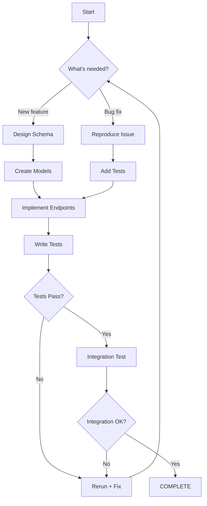

# Ralph Loop File & State Management Patterns

## Core File Patterns

### PROMPT.md Structure

The standard Ralph loop approach uses a **PROMPT.md** file that serves as the primary instruction document for the agent.

#### Basic Structure
```markdown
# Task Instructions

## Objective
What needs to be accomplished

## Success Criteria
When to consider work complete

## Workflow Steps
1. First action
2. Second action
3. Verification

## Output Format
<promise>COMPLETE</promise>
```

#### Complex Structure with Mermaid

For complex workflows, PROMPT.md can include detailed flowcharts:

```markdown
# Multi-Feature Implementation

## Objective
Build user authentication system with registration, login, and password reset

## Workflow Flow



## Context Requirements
- Database schema from `schema.sql`
- Existing patterns in `/src/database/`
- API documentation in `/api/docs/`

## Tools Available
- read
- write
- edit
- bash
- webfetch

## Stopping Condition
<promise>AUTH_SYSTEM_COMPLETE</promise>
```

## Step-by-Step Pattern: PROMPT-<step>.md

For multi-agent or sequential workflows, each step gets its own prompt file:

```
your-project/
├── PROMPT.md                    # Overall workflow
├── PROMPT-01-design.md          # Step 1: Design phase
├── PROMPT-02-implementation.md  # Step 2: Implementation
├── PROMPT-03-testing.md         # Step 3: Testing
└── PROMPT-04-deployment.md      # Step 4: Deployment
```

### Example: PROMPT-01-design.md
```markdown
# Step 1: System Design

## Your Role
You are the system architect. Design the user authentication flow.

## Inputs
- PROMPT.md for overall objectives
- `requirements.txt` for feature needs
- `architecture/` for existing patterns

## Your Task
1. Define user flows (login, registration, reset)
2. Design database schema
3. Plan API endpoints
4. Identify security requirements

## Output Format
<promise>DESIGN_COMPLETE</promise>

## Files to Create
- `design/user-flows.md`
- `design/schema-design.sql`
- `design/api-endpoints.md`

## Next Step
When complete, the system will proceed to PROMPT-02-implementation.md
```

### Example: PROMPT-02-implementation.md
```markdown
# Step 2: Implementation

## Your Role
You are the implementer. Build the designed system.

## Inputs
- PROMPT.md for overall objectives
- PROMPT-01-design.md for specifications
- Generated design files

## Your Task
1. Create database models
2. Build API endpoints
3. Implement business logic
4. Add error handling

## Context from Previous Step
```
{contents of design files}
```

## Output Format
<promise>IMPLEMENTATION_COMPLETE</promise>

## Verification
Run these commands before claiming complete:
- `npm test`
- `npm run lint`
- `npm run typecheck`

## Next Step
When complete, proceed to PROMPT-03-testing.md
```

## Pattern Benefits

### Why PROMPT.md + PROMPT-<step>.md?

1. **Clarity**: Separate files for each step reduce context noise
2. **Versioning**: Can track changes to specific steps independently
3. **Parallelism**: Different agents can work on different PROMPT files simultaneously
4. **Progress Tracking**: Easy to see which step you're on
5. **Debugging**: Can rollback to specific step if something breaks

### Mermaid Diagrams Advantages

1. **Visualization**: Complex workflows are easier to understand
2. **Communication**: Good for documentation and team collaboration
3. **Self-Documenting**: The diagram documents the workflow itself
4. **Branching Logic**: Shows conditional paths, loops, and decision points

## State Management with Inboxes

Traditional Ralph loops maintain state through:

### 1. File-Based State
```
state/
├── current-step.json
├── iteration-count.txt
├── last-error.log
└── context/
    ├── previous-output.md
    ├── errors-encountered.md
    └── suggestions.md
```

### 2. Agent Inbox Pattern
Each agent has an "inbox" where they receive tasks and produce results:

```bash
agents/
├── builder/
│   ├── inbox/
│   │   ├── task-001.json
│   │   └── task-002.json
│   │   └── completed/
│   │       └── task-001-result.json
│   └── state.json
│
├── verifier/
│   ├── inbox/
│   │   └── task-001.json
│   │   └── completed/
│   │       └── task-001-result.json
│   └── state.json
```

**Inbox Format:**
```json
{
  "id": "task-001",
  "type": "build",
  "priority": "high",
  "assigned_to": "builder",
  "status": "pending",
  "context": {
    "from_step": "planner",
    "dependencies": [],
    "input_files": ["schema.sql", "requirements.txt"]
  },
  "prompt": "Build the user authentication endpoints...",
  "output_format": "<promise>BUILD_COMPLETE</promise>",
  "deadline": "2026-02-25T12:00:00Z",
  "max_iterations": 5
}
```

**Result Format:**
```json
{
  "id": "task-001",
  "status": "completed",
  "result": "<promise>BUILD_COMPLETE</promise>",
  "output_files": [
    "src/auth/login.ts",
    "src/auth/register.ts",
    "src/auth/reset.ts"
  ],
  "success": true,
  "iteration_count": 1,
  "errors_encountered": [],
  "execution_time_ms": 2350
}
```

## Todo List Management

### Markdown-Based Todo Lists

Simple approach using markdown files:

```markdown
# Ralph Loop Tasks

## In Progress
- [x] Design database schema
- [x] Create user models
- [ ] Implement login endpoint
- [ ] Implement registration endpoint
- [ ] Add password reset
- [ ] Write unit tests
- [ ] Integration testing

## Pending
- [ ] Deploy to staging
- [ ] Performance testing
- [ ] Documentation

## Completed
- [x] Analyze requirements
- [x] Review existing patterns
```

**Benefits:**
- Simple, human-readable
- Works with version control
- Easy to edit manually
- Can be rendered as documentation

**Drawbacks:**
- Can get messy with active loops
- Hard to track iterations
- No programmatic API

### Beads Tool

[Beads](https://github.com/steveyegge/beads) is a distributed, git-backed graph issue tracker specifically designed for AI agents. Created by Steve Yegge.

**Key Features**:
- **Dolt-Powered**: Version-controlled SQL database with cell-level merge, native branching
- **Agent-Optimized**: JSON output, dependency tracking, auto-ready task detection
- **Zero Conflict**: Hash-based IDs (bd-a1b2) prevent merge collisions
- **Compaction**: Semantic "memory decay" summarizes old closed tasks (saves context window)
- **Messaging**: Message issue type with threading (--thread), ephemeral lifecycle
- **Graph Links**: relates_to, duplicates, supersedes, replies_to for knowledge graphs

**Installation**:
```bash
# Install beads CLI (system-wide - don't clone this repo into your project)
curl -fsSL https://raw.githubusercontent.com/steveyegge/beads/main/scripts/install.sh | bash

# Initialize in YOUR project
cd your-project
bd init
```

**Essential Commands**:
```bash
bd ready              # List tasks with no open blockers
bd create "Title" -p 0  # Create P0 task
bd update <id> --claim  # Atomically claim task (assignee + in_progress)
bd dep add <child> <parent>  # Link tasks
bd show <id>          # View task details and audit trail
```

**Why Beads excels for AI agents**:
- Provides persistent, structured memory for agents
- Replaces messy markdown plans with dependency-aware graph
- Allows agents to handle long-horizon tasks without losing context
- Hash-based IDs prevent merge collisions in multi-agent workflows
- Auto-ready task detection

**For Ralph loops specifically**:
```bash
# Track iterations
bd create "Build authentication system (iteration 1)" -p 0

# Mark ready when no blockers
bd ready

# Mark complete when done
bd update <id> --done

# Create dependency when next iteration
bd dep <new_id> <old_id>
```

**Stealth Mode**: Run `bd init --stealth` to use Beads locally without committing to main repo

**Comparison with Markdown Todos**:
| Feature | Beads | Markdown |
|---------|-------|----------|
| Dependency tracking | ✅ Built-in | ❌ Manual |
| Conflict resolution | ✅ Hash-based IDs | ❌ Merge conflicts |
| Context window | ✅ Compaction | ❌ Bloated lists |
| Agent integration | ✅ Agent-optimized | ❌ Text parsing |
| Version control | ✅ Git-backed | ✅ Git-tracked |

**When to use Beads**:
- Multi-agent workflows (need coordination)
- Long-horizon tasks (context management critical)
- Complex dependencies (need graph structure)
- Ralph loops with 10+ iterations (need compaction)
- Collaborative AI projects (need zero-conflict tracking)

**Usage Example:**
```bash
# Create a todo list
beads create tasks.md

# Add a task
beads add tasks.md "Implement login endpoint" --priority high

# Complete a task
beads complete tasks.md 1

# List pending tasks
beads list tasks.md --status pending

# Export to JSON
beads export tasks.md --format json > tasks.json
```

**Ralph Loop Integration:**
```typescript
// Monitor bead tasks in a loop
const tasks = beads.list("tasks.md", { status: "pending" })

for (const task of tasks) {
  await assignToAgent(task)
  
  const result = await executeAgentTask(task)
  
  if (result.success) {
    beads.complete("tasks.md", task.id)
  } else {
    // Update with iteration count
    beads.update("tasks.md", task.id, {
      iterations: task.iterations + 1,
      last_error: result.error
    })
  }
}
```

### File System as Database

For most Ralph loops, a simple file system approach works best:

```typescript
// Simple state management
interface RalphLoopState {
  current_step: string
  iteration_count: number
  last_success: string | null
  last_failure: string | null
  completed_steps: string[]
  pending_steps: string[]
  context: Record<string, any>
}

// Save to JSON
const state: RalphLoopState = {
  current_step: "implementation",
  iteration_count: 3,
  last_success: "design_complete",
  last_failure: null,
  completed_steps: ["planning", "design"],
  pending_steps: ["testing", "deployment"],
  context: { /* ... */ }
}

fs.writeFileSync(".ralph/state.json", JSON.stringify(state, null, 2))
```

**Directory Structure:**
```
.ralph/
├── state.json               # Current loop state
├── config.yaml              # Workflow configuration
├── prompts/
│   ├── PROMPT.md
│   ├── PROMPT-01-design.md
│   ├── PROMPT-02-implement.md
│   └── PROMPT-03-test.md
├── inboxes/
│   ├── builder/
│   ├── verifier/
│   └── planner/
└── logs/
    ├── iterations/
    │   ├── iteration-001.json
    │   └── iteration-002.json
    └── errors/
        └── error-001.log
```

## Choosing the Right Approach

### Use File-Based State When:
- Simple workflows
- Need version control
- Single agent
- Lower complexity

### Use Inboxes When:
- Multiple agents
- Task queues
- Need to track assignments
- Async execution

### Use Beads/Tools When:
- Complex task management
- Need iteration tracking
- Want programmatic API
- Multiple concurrent loops

## Best Practices

1. **Keep PROMPT.md Focused**: One clear objective per prompt file
2. **Use Mermaid for Complexity**: Visualize workflows with 4+ steps
3. **State in JSON**: Easier to parse and manipulate programmatically
4. **Log Everything**: Track iterations, errors, and successes
5. **Clean State after Success**: Clear `.ralph/` on successful completion
6. **Version Control Prompts**: Commit PROMPT files to track evolution
7. **Document Patterns**: Use examples in this doc as templates

## Example: Complete Multi-Step Ralph Loop

See `resources/examples/full-workflow/` for a complete implementation example including:
- PROMPT.md with Mermaid diagram
- PROMPT-*.md files for each step
- State management
- Todo list (Beds)
- Agent inboxes
- Execution logs
